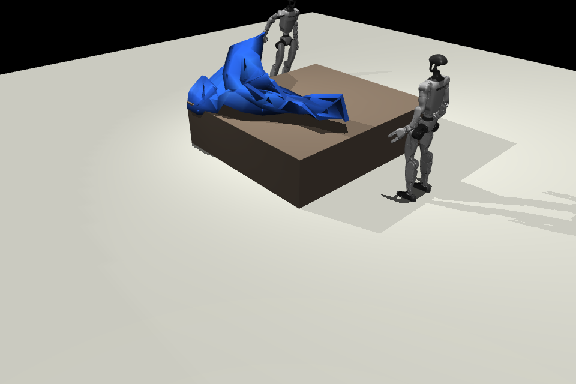
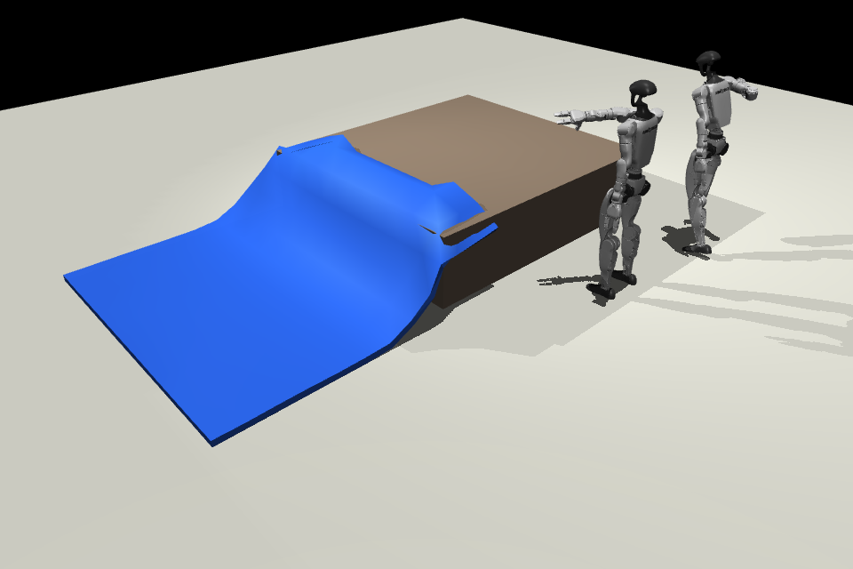

# Unitree G1 Two-Humanoid Bed-Making Demo

This demo implements the GitHub issue #2 scenario: a robotic system with two
Unitree G1 humanoids, a bed object, and a bedsheet object. The control robot
acts as the task planner, and the worker robot acts as an assisting effector.

## What It Builds

- A 2.0 m x 1.8 m x 0.5 m bed centered in the scene.
- A triangulated bed OBJ mesh and a matching collision box.
- A 2.2 m x 2.0 m bedsheet represented as a MuJoCo 2D flex grid made from
  triangles.
- A control G1 placed 0.5 m from the left side of the bed.
- A worker G1 placed 0.5 m from the right side of the bed.
- A deterministic "make the bed" sequence:
  1. find a bedsheet corner,
  2. place it on the far bed corner,
  3. run along the sheet edge to the next corner,
  4. place adjacent corners until all four corners are placed,
  5. have the worker hold already placed corners when they drift.
- Whole-body scripted robot motion for walking between stations, squatting,
  bending at the waist, reaching, grasping, placing, and holding.
- An intentionally imperfect sheet outcome with overhang, slack, and wrinkles.

## Current Demo Snapshots

Picking up a corner and lifting it over the bed:



Placing the corner on the bed; the rest of the sheet drapes via cloth
physics rather than being teleported into place:



These frames are produced by the run described below. The bedsheet collides
with the bed top, the robots stand and walk around the bed footprint without
warping through it, and the placement after release leaves the sheet with
realistic slack and overhang instead of pinning it to perfect bed-corner
positions.

## Device Connect

Two complementary surfaces are wired up:

1. **In-process** — `ControlPlanner` and `WorkerEffector` (in
   `examples/unitree_g1_bed_making_demo.py`) use the same
   `holdCorner` / `releaseCorner` / `assistPlace` / `setIdle` / `getStatus`
   names a real Device Connect participant would. The MuJoCo demo calls
   these locally so the simulation runs without needing a broker.
2. **On the network** — `strands_robots/device_connect/bed_making_g1_driver.py`
   wraps the same RPC surface as a proper `DeviceDriver`, and
   `examples/unitree_g1_bed_making_device_connect_sidecar.py` spins up one
   `DeviceRuntime` per robot so they appear in the Device Connect dashboard.

### Robots show up while the demo is running

The MuJoCo demo automatically starts a `DeviceRuntime` in a background
thread for each robot when launched:

```bash
.venv/bin/python examples/unitree_g1_bed_making_demo.py
```

Both robots appear on the Device Connect portal's `/devices` page with
`device_type=unitree_g1_bed_making` and online status for the duration of
the simulation. They are cleanly unregistered when the demo exits.

Defaults:

- Broker: `nats://fabric.deviceconnect.dev:4222` (override with
  `--device-connect-nats-url` or `$DEVICE_CONNECT_NATS_URL`).
- Credentials: `.credentials/beta-unitree-g1-humanoid-0.creds.json`
  (control) and `.credentials/beta-unitree-g1-humanoid-1.creds.json`
  (worker). Skip with `--no-device-connect`.

### Sidecar without the simulation

To register the robots without running MuJoCo (e.g. for dashboard testing
on a machine without the assets), run the sidecar directly:

```bash
.venv/bin/python examples/unitree_g1_bed_making_device_connect_sidecar.py
```

Override credentials with `--credentials role=path` (repeatable).

### Use a real `device-connect-edge` install

The compat shim at `strands_robots/device_connect/_compat.py` resolves to
the installed `device_connect_edge` package — see
<https://github.com/Arm/device-connect>. Install from source:

```bash
gh repo clone Arm/device-connect /tmp/device-connect
.venv/bin/python -m pip install /tmp/device-connect/packages/device-connect-edge
.venv/bin/python -m pip install /tmp/device-connect/packages/device-connect-agent-tools
```

## Run

Use the repo virtual environment:

```bash
cd /Users/wahbro01/workspaces/git/robots
.venv/bin/python examples/unitree_g1_bed_making_demo.py
```

You do not need to export `STRANDS_ASSETS_DIR` for this demo. The script
defaults it to the repo-local cache at `.strands_robots/assets` unless you have
already set it. Set `STRANDS_ASSETS_DIR` only if you intentionally want to use a
different asset cache.

The default run opens the MuJoCo passive viewer in an interactive Terminal
session. PNG frame export is opt-in:

```bash
.venv/bin/python examples/unitree_g1_bed_making_demo.py --render-frames
```

Fast compile-only check:

```bash
.venv/bin/python examples/unitree_g1_bed_making_demo.py --dry-run
```

Headless or CI simulation without a viewer:

```bash
.venv/bin/python examples/unitree_g1_bed_making_demo.py --no-viewer
```

## Platform Notes

On macOS, MuJoCo frame rendering generally needs `mjpython` so Cocoa/GLFW can
own the foreground app thread. From a normal Terminal session you can run:

```bash
.venv/bin/mjpython examples/unitree_g1_bed_making_demo.py
```

The script also tries to re-exec through `.venv/bin/mjpython` automatically
when launched from a real macOS Terminal TTY. In non-interactive shells, use
`--no-viewer`.

On Ubuntu Linux, `mjpython` is not required and should not be used. For
simulation-only runs, use `--no-viewer`. For headless frame rendering, install
and select a MuJoCo GL backend:

```bash
sudo apt-get install libosmesa6-dev
MUJOCO_GL=osmesa .venv/bin/python examples/unitree_g1_bed_making_demo.py --no-viewer --render-frames
```

GPU/EGL rendering can also work when EGL and the correct GPU driver libraries
are installed:

```bash
MUJOCO_GL=egl .venv/bin/python examples/unitree_g1_bed_making_demo.py --no-viewer --render-frames
```

Outputs are written to:

```text
artifacts/unitree_g1_bed_making/
```

The output directory includes the generated MJCF scene, OBJ meshes, PNG frames
when rendering is available, and `summary.txt`.

## Current Fidelity

This is a deterministic simulator demo, not a learned whole-body manipulation
policy. The G1 limb joints are driven by PD position actuators against scripted
pose targets, but the rest of the physics is now closer to a real environment:

- **Mocap-driven floating bases.** Each G1 pelvis is welded (via a stiff MuJoCo
  `<weld>` equality) to a mocap body that the script moves around the scene.
  The robots do not have a balanced walking controller, but they also no longer
  warp through the bed or fight the dynamics — the base follows a kinematic
  target while the legs/arms remain PD-actuated.
- **Physical sheet grasps via kinematic anchors.** The cloth is a MuJoCo
  `flexcomp` 2D grid with edge equalities keeping it nearly inextensible.
  Each sheet corner has a dedicated mocap "anchor" body and a corresponding
  weld equality between the anchor and the cloth corner. To pick up a corner
  the planner snaps the anchor to the corner's current world position, then
  activates the weld; the cloth corner is then dragged along whatever path
  the planner writes into the anchor's mocap pose. Releasing deactivates the
  weld and the cloth physics finishes the placement.
- **No path through the bed.** Walks between stations are planned to skirt the
  bed footprint via the foot-edge waypoints rather than driving the floating
  base straight through obstacles.
- **Imperfect outcome.** The sheet ends up draped with the natural slack and
  wrinkles produced by the cloth physics, not pinned to perfect bed-corner
  positions.

## Known Limitations

- Cloth physics with stiff edge equalities can degenerate in the later
  placement steps if a second corner is dragged across the bed while the
  previously placed corner is still resting nearby. The first one or two
  placements look the most realistic; later steps may show the sheet
  collapsing into a sparse drape. Reducing `--phase-steps` or
  `SHEET_GRID_X/Y` makes the run finish, but a future pass should replace
  the flex edge equalities with the MuJoCo elasticity plugin for proper
  cloth behaviour under multi-corner manipulation.
- The robots use mocap-anchored floating bases for visualisation, not a
  balanced locomotion controller. They do not generate ground reaction
  forces or step naturally — only the upper-body PD-controlled motion is
  physically simulated.
