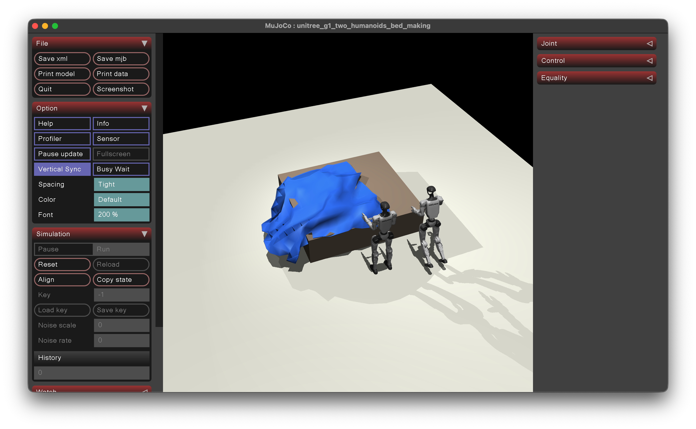

# Unitree G1 Two-Humanoid Bed-Making Demo

This demo implements the GitHub issue #2 scenario: a robotic system with two
Unitree G1 humanoids, a bed object, and a bedsheet object. The control robot
acts as the task planner, and the worker robot acts as an assisting effector.

## What It Builds

- A 2.0 m x 1.8 m x 0.5 m bed centered in the scene.
- A triangulated bed OBJ mesh and a matching collision box.
- A 2.2 m x 2.0 m bedsheet represented as a MuJoCo 2D flex grid made from
  triangles.
- A control G1 placed 0.5 m from the left side of the bed.
- A worker G1 placed 0.5 m from the right side of the bed.
- A deterministic "make the bed" sequence:
  1. find a bedsheet corner,
  2. place it on the far bed corner,
  3. run along the sheet edge to the next corner,
  4. place adjacent corners until all four corners are placed,
  5. have the worker hold already placed corners when they drift.
- Whole-body scripted robot motion for walking between stations, squatting,
  bending at the waist, reaching, grasping, placing, and holding.
- An intentionally imperfect sheet outcome with overhang, slack, and wrinkles.

## Current Demo Snapshot



This screenshot is intentionally included as a quick visual reference for the
current state of the demo. The scene has the two G1 robots, the bed, and the
triangulated bedsheet, but the remaining work is to make the sheet collide with
the bed and hands realistically and to replace the floating/spinning scripted
robot motion with believable standing, walking, bending, and grasping.

## Device Connect

Device Connect is the intended robot-to-robot coordination layer for the next
iteration of this demo. The library lives at
<https://github.com/Arm/device-connect>; use `device-connect-edge` for robot
sidecar/runtime code and `device-connect-agent-tools` for agent-side discovery
and RPC calls.

Local source install:

```bash
gh repo clone Arm/device-connect /tmp/device-connect
.venv/bin/python -m pip install /tmp/device-connect/packages/device-connect-edge
.venv/bin/python -m pip install /tmp/device-connect/packages/device-connect-agent-tools
```

This checkpoint still coordinates the control robot and worker robot inside one
local scripted MuJoCo process. The next Device Connect step is to split that
scripted coordination into two registered robot devices, where the control robot
plans the bed-making task and invokes worker robot actions such as `holdCorner`,
`releaseCorner`, and `assistPlace` over Device Connect.

## Run

Use the repo virtual environment:

```bash
cd /Users/wahbro01/workspaces/git/robots
.venv/bin/python examples/unitree_g1_bed_making_demo.py
```

You do not need to export `STRANDS_ASSETS_DIR` for this demo. The script
defaults it to the repo-local cache at `.strands_robots/assets` unless you have
already set it. Set `STRANDS_ASSETS_DIR` only if you intentionally want to use a
different asset cache.

The default run opens the MuJoCo passive viewer in an interactive Terminal
session. PNG frame export is opt-in:

```bash
.venv/bin/python examples/unitree_g1_bed_making_demo.py --render-frames
```

Fast compile-only check:

```bash
.venv/bin/python examples/unitree_g1_bed_making_demo.py --dry-run
```

Headless or CI simulation without a viewer:

```bash
.venv/bin/python examples/unitree_g1_bed_making_demo.py --no-viewer
```

## Platform Notes

On macOS, MuJoCo frame rendering generally needs `mjpython` so Cocoa/GLFW can
own the foreground app thread. From a normal Terminal session you can run:

```bash
.venv/bin/mjpython examples/unitree_g1_bed_making_demo.py
```

The script also tries to re-exec through `.venv/bin/mjpython` automatically
when launched from a real macOS Terminal TTY. In non-interactive shells, use
`--no-viewer`.

On Ubuntu Linux, `mjpython` is not required and should not be used. For
simulation-only runs, use `--no-viewer`. For headless frame rendering, install
and select a MuJoCo GL backend:

```bash
sudo apt-get install libosmesa6-dev
MUJOCO_GL=osmesa .venv/bin/python examples/unitree_g1_bed_making_demo.py --no-viewer --render-frames
```

GPU/EGL rendering can also work when EGL and the correct GPU driver libraries
are installed:

```bash
MUJOCO_GL=egl .venv/bin/python examples/unitree_g1_bed_making_demo.py --no-viewer --render-frames
```

Outputs are written to:

```text
artifacts/unitree_g1_bed_making/
```

The output directory includes the generated MJCF scene, OBJ meshes, PNG frames
when rendering is available, and `summary.txt`.

## Current Fidelity

This is a deterministic simulator demo, not a learned whole-body manipulation
policy. The G1 bases, legs, waist, arms, wrists, and finger joints are scripted
to make the robot roles visible. The bedsheet is still a MuJoCo flex grid, but
the scripted task moves the cloth as a coherent triangulated surface instead of
pinning isolated nodes. That keeps the sheet rectangle visually inextensible
while preserving realistic imperfections such as wrinkles, sag, and uneven
overhang.

Known physics and animation gaps remain: the sheet/bed/hand contacts are not yet
robust enough to prevent the sheet from passing through the bed, the hands do
not physically grasp the sheet, and the G1 bases are scripted rather than driven
by a balanced walking controller. Favor future fixes that improve realistic
contact, locomotion, and imperfect task outcomes over visually perfect sheet
placement.
