# Bed-Making, In Real Life — Unitree G1 EDU (23-DOF) + a Human Partner

> The sibling of [`RL_WHOLE_BODY_REACH.md`](RL_WHOLE_BODY_REACH.md) (the **simulation**). That
> document teaches two free-base G1s to balance-while-reaching in Isaac Sim. **This one takes the
> demo to the *physical* robot** ([armwaheed/robots#3](https://github.com/armwaheed/robots/issues/3)):
> a real **23-DOF Unitree G1 EDU with Brainco hands**, making a bed **with a human partner it asks
> for help** when it gets stuck — orchestrated by **Device Connect**, perceived with the robot's own
> **LiDAR + RGB + depth**.
>
> *Methodology rule, unchanged from the sim work: **verify by what the human sees** (rendered frames,
> live sensor reads, the robot actually speaking) — never by telemetry alone. Every claim below was
> checked on the hardware or by eye.*

---

## 1. The robot, in the room

The EDU is standing in a home office; the bed is in the next room (the demo will walk it over). The
whole IRL effort is grounded in *this* robot and *this* space — its sensors, its closed audio system,
its real DOF.

| The G1 EDU at its post | What its head camera actually sees |
|---|---|
| 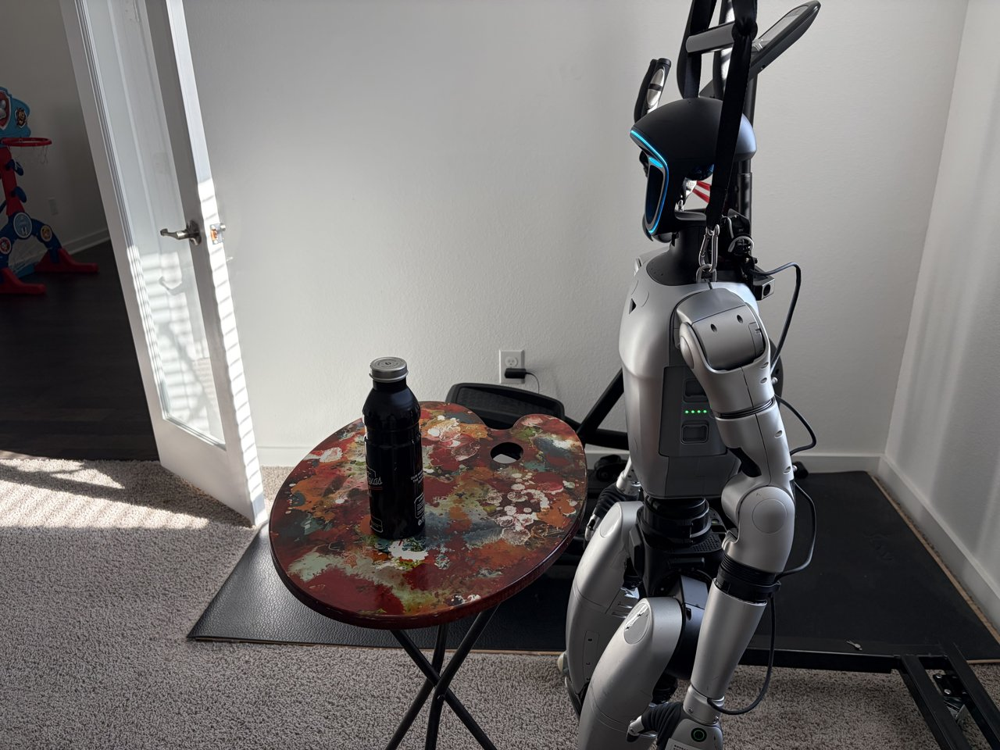 |  |

*Left: the 23-DOF G1 EDU (Brainco hands) beside a small round table. Right: the **robot's own** head
RealSense, down-tilted 51.29°, framing the near table and floor — not the room — exactly as
`robotics-connect` characterized it (that pitch is why the **LiDAR**, not the camera, does room-scale
detection).*

---

## 2. What carried over from the sim, and what is new

| Axis | Sim (issue #2) | IRL (issue #3) |
|---|---|---|
| Robot | 2 × **29-DOF**, Inspire hands | **1 × 23-DOF EDU**, Brainco hands |
| Partner | a second robot | a **human**, asked for help only when stuck |
| Channel | robot ↔ robot over Device Connect | robot **speaks**; human replies as a **Device Connect agent** |
| Perception | sim RayCaster + camera | the **real** LiDAR + RGB + depth (this doc) |
| Goal | sheet drawn in sim | a **real** bed |

The hard sim results (balance-while-reach, ambidexterity, the grip experiments) are documented in the
sim writeup. Here we focus on the three things that only exist on hardware: a **transfer-valid
policy**, **real perception**, and the **human voice loop** (and the deep rabbit-hole the robot's
microphone turned out to be).

---

## 3. A transfer-valid 23-DOF policy

The sim policy used all **29** body DOF — including the **waist pitch** it leans on. The real EDU
**does not have** that joint (nor waist roll, nor wrist pitch/yaw — 6 joints absent), so the sim
policy is a valid sim result but **not transfer-valid**. We retrained for the robot's actual body:

- **Action = the 23 real EDU joints** (12 legs + waist-yaw + 10 arms incl. wrist-roll); the 6 absent
  joints are **locked rigid** and excluded from the action set.
- **Observation restricted to those 23 joints** → the obs vector is **85-D** (vs 151-D), i.e. exactly
  what the hardware can report. *(Keeping the obs/action contract explicit is the documented #1
  sim-to-real lever for the G1 — the public deployment failures are obs-layout / joint-order
  mismatches, e.g. IsaacLab #4037, not the DOF-locking itself.)*
- **EE = `wrist_roll_link`** (the distal actuated link on the 23-DOF arm).

Trained from scratch (2048 envs × 1500 iters on the DGX Spark GB10) and **eye-verified**: the EDU
balances on its own two feet at the bedside and reaches onto the bed, no topple, no kinematic cheats.

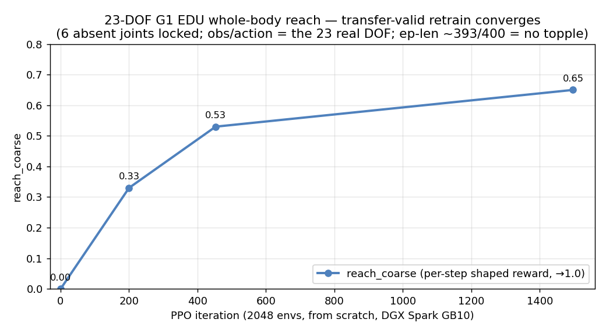

| reach over the bedside | lateral reach (the drag direction) |
|---|---|
| 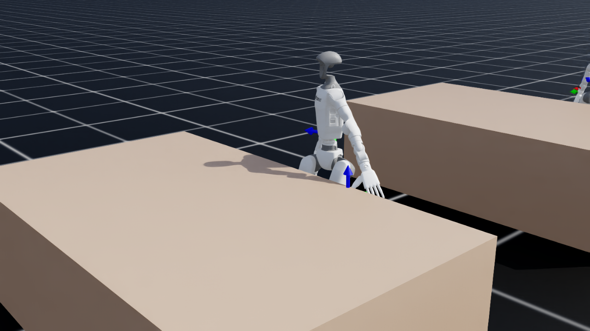 | 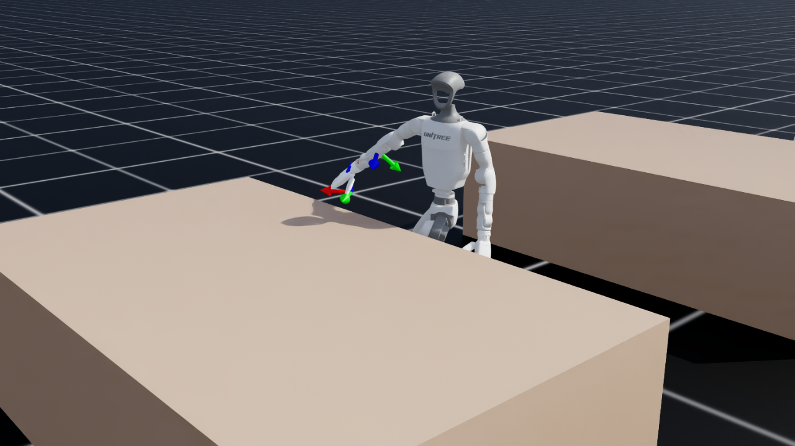 |

*`reach_coarse` climbs 0.32 → 0.65 while mean episode length holds at ~393/400 — nearly no early
terminations, i.e. it stays upright. (Mean reward is regularizer-dominated and misleading; the real
signals are `reach_coarse` + ep-len + the rendered eval.)* Full clip:
[`media/rl/g1edu/bed_reach_g1edu.mp4`](media/rl/g1edu/bed_reach_g1edu.mp4). Deployable policy at
[`rl/policy_g1edu/`](rl/policy_g1edu/); env in [`rl/robot_cfg_g1edu.py`](rl/robot_cfg_g1edu.py) +
[`rl/bed_reach_env_cfg_g1edu.py`](rl/bed_reach_env_cfg_g1edu.py).

---

## 4. Real perception — LiDAR-first, on the actual sensors

We pulled live readings from the robot (`robotics-connect` `lidar_sight` + `depth_camera_sight`):

| Crown LiDAR (Livox MID-360), top-down | Head depth (RealSense D435i) |
|---|---|
| 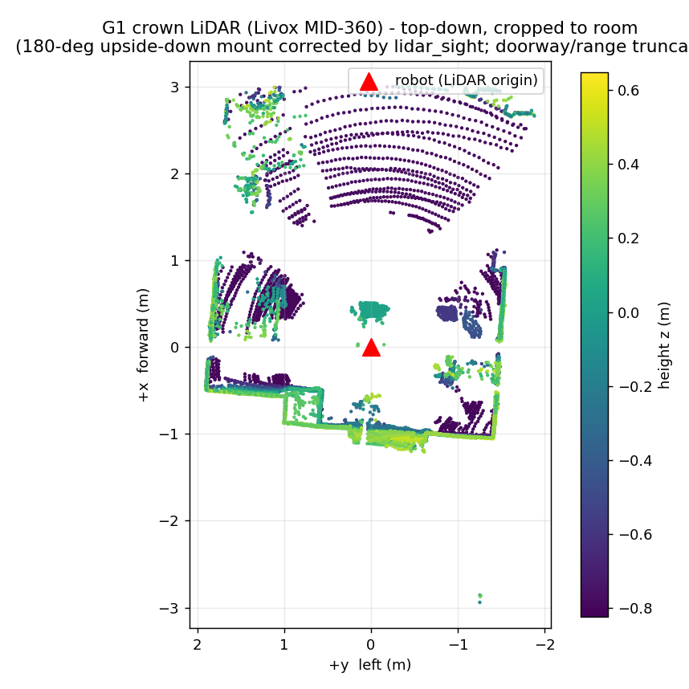 | 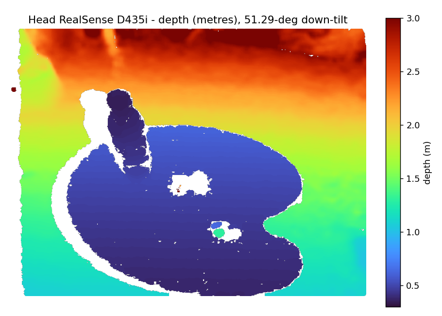 |

- The **LiDAR is mounted upside-down** in the crown; `lidar_sight` applies the **180° roll
  correction** so the cloud comes out in a clean body frame (+x fwd, +y left, +z up). The raw scan
  also sees straight through the office's **open doorway** (points out to ~10 m); the view above is
  **cropped to the room** (radial + box, 11,361 of 12,423 points kept) — the truncation the bed task
  needs so the detector reasons about *this* room, not the hallway.
- **Hand placement is LiDAR-first.** The near-field LiDAR is accurate to ~±4 cm; the head depth
  camera's IR stereo produces artifacts on textureless bedding (visible as the holes/speckle in the
  depth map), so depth is used only for the **coarse** coverage check, never the fine hand target —
  the user's hardware observation, corroborated by the cloth-manipulation literature (Seita et al.
  2019: pick on depth, not RGB). Code: [`perception.py`](perception.py) (`grasp_point_from_lidar`,
  `BedPerception`) — the *same* numpy runs on the sim RayCaster cloud and this real `lidar_sight`
  cloud (the real-to-sim loop).

### 4.1 In the master bedroom — perceiving the actual bed

The robot is now standing in the **master bedroom**, at its fixed start pose: in front of the closed
double doors (to the master bathroom), **facing the bed** ~1.5–2.5 m away across clear carpet. Here is
what each sensor reports from that spot — each checked against ground-truth photos of the room.

| Crown LiDAR (annotated, near-field) | Head RGB (down-tilt 51.29°) | Head depth (RealSense D435i) |
|---|---|---|
| 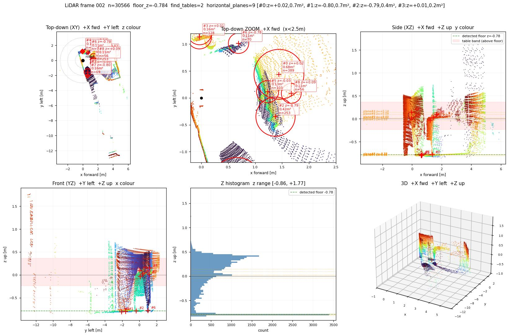 | 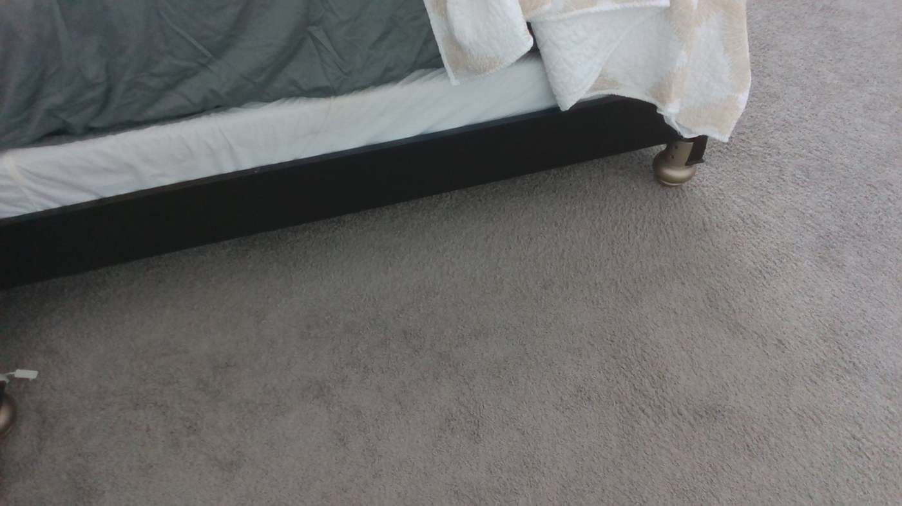 | 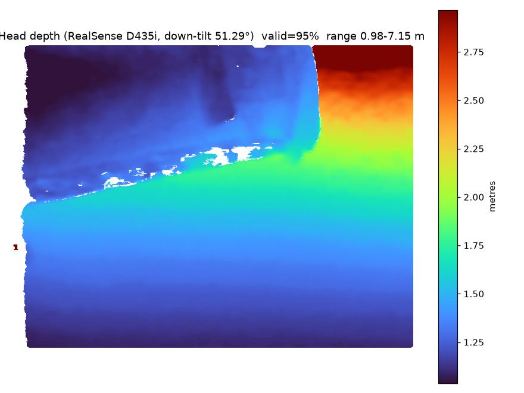 |

- **LiDAR (left).** `find_tables()` locks onto the **bed as a 0.68 m² flat plane at (1.44 m forward,
  0.44 m left)** at mattress height, with the floor at z ≈ −0.78 m and the far window-wall at ~5 m —
  exactly the room geometry (bed ahead and slightly left, headboard against the window).
- **RGB (centre).** The down-tilted head camera frames the **bed's near edge** — dark frame, grey
  fitted sheet, white mattress, the cream comforter draped over the side, brass feet on carpet — the
  same bed seen in the room photos.
- **Depth (right).** The bed edge and receding floor read from ~1.0 m out, **but the white speckle is
  invalid depth — the stereo artifacts the IR projector leaves on textureless bedding and carpet.**
  This is exactly why **hand placement is LiDAR-first**: the near-field LiDAR has none of those holes.

So from its start pose the robot already sees the bed it has to make — a clean ~1.4 m approach on a
clear path — which is what the walk-to-bed step (§9) drives toward.

---

## 5. Voice OUT — the robot speaks (verified on hardware)

The robot asks for help through its **own chest speaker**, via Unitree's `AudioClient` over the DDS
`"voice"` service — built as [`robotics-connect/unitree/g1/voice`](https://github.com/armwaheed/robotics-connect/tree/g1-audio-module/unitree/g1/voice)
and **verified live**: the G1 physically spoke "Hello. I am the bed-making robot…".

Two findings worth recording for the next session:
- `TtsMaker(text, speaker_id)` — on this EDU firmware **`speaker_id=0` is Chinese (female)**; **1–4
  are English** (faint accent). We default to **4**.
- `PlayStream` accepts raw **16 kHz / mono / 16-bit PCM** (bring-your-own TTS); `SetVolume` and
  `LedControl` (used as an "I'm listening" cue) round it out.

---

## 6. Voice IN — the microphone is a closed system (the honest record)

The "listen" half was a genuine rabbit hole, and the result is a clear, useful negative finding. The
goal: read the G1's 4-mic array so the robot could hear the human's reply. **Every native path was
exhausted:**

| Attempt | Result |
|---|---|
| `unitree_sdk2` `AudioClient` mic/ASR | **not exposed** — ASR api id `1002` is *registered but never called*; calling it returns error `3104` |
| Serial / UART / I2C | **no path** — the mic is an on-board Tegra-APE ALSA codec, not a serial device |
| Read the factory binary's config | `master_service` is **stripped** (no ALSA params); it only supervises `ota_pipe` + `video_hub_pc4` |
| Direct ALSA capture (`hw:APE,0`) | the only capture node `pcmC1D0c` is **held exclusively** by the factory |
| Play silence → full-duplex (the AEC trick) | **opens a capture** (`pcm0c` RUNNING, S16/2ch/44100) — but it's the AEC *reference*, not the live mic |
| Wake word ("Hello Unitree") → real listen | the mic **does** open — but the route is **not on the XBAR mux** (`ADMAIF1 Mux = None`) so it can't be fanned to a parallel ADMAIF |
| Parallel XBAR tap (DMIC1-4 / I2S1-6 → ADMAIF2) | **all at/below noise floor** (chart below) |
| DDS republish (`rt/audiosender` / `rt/audio_msg`) | **idle** — no traffic |
| `journalctl -u unitree_voice` / service logs | **no ASR process and no voice log exist** on this unit |

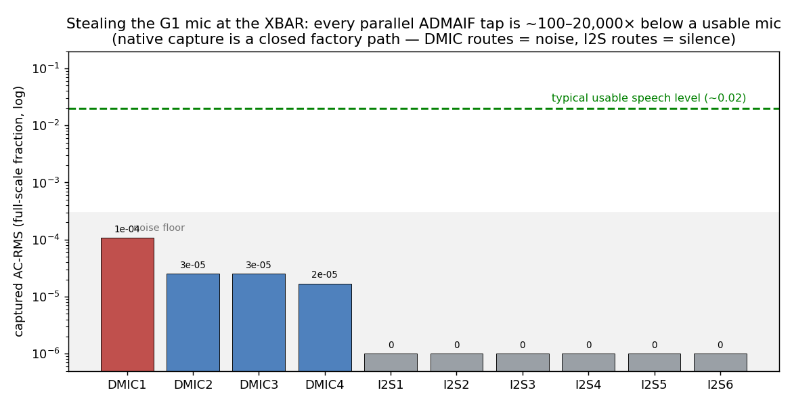

**Root cause:** the G1 EDU has **no on-board ASR**. With "Wake-up Conversation Mode" enabled in the
Unitree app, a *closed firmware wake-detector* briefly opens the mic and **streams it off-robot** to
Unitree's app/cloud for recognition — there is no local userspace hook (no XBAR-visible route, no DDS
republish, no log, no ASR result to read). Extracting it would require root-tracing an ephemeral
closed process or intercepting the encrypted cloud stream — not something to do on a balancing robot.

| The app mode that opens the mic | |
|---|---|
| 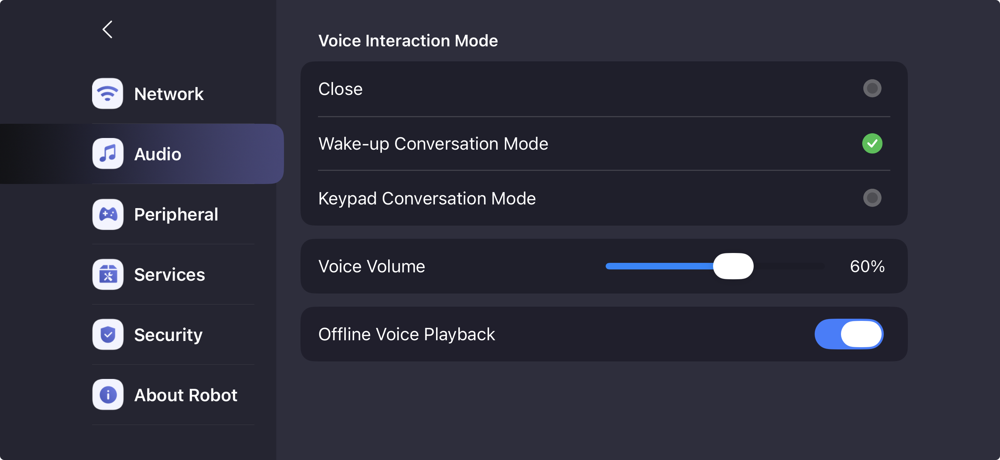 | The toggle that lets the closed firmware open `pcm0c` on the wake word — confirmed by watching the capture substream go `RUNNING` while a person spoke. |

We filed the full reproduction (above) and took it to **Unitree engineering support** for the
supported way to read the array from userspace. The mic findings are also documented in the voice
module's [`README.md`](https://github.com/armwaheed/robotics-connect/tree/g1-audio-module/unitree/g1/voice).

### 6.1 Unitree engineering support's verdict — the question is now closed

Unitree's engineering support confirmed the result outright (support work order, June 2026): **the
G1's microphone is not exposed as a developer interface.** The only supported speech route is the
robot's built-in automatic speech recognition, together with the other voice-UI features documented
under [VuiClient_Service](https://support.unitree.com/home/en/G1_developer/VuiClient_Service). To run
your own speech recognition — or anything that needs the raw array — their guidance is to **connect an
external microphone/speaker array through the USB-C ports** instead of tapping the built-in one.

So the closed-system result above is *by design*, not a bug to root around — which settles why the
human loop is built the way §7 describes. Rather than crack the onboard mic, we route the human into
**Device Connect** as their own agent (a Bluetooth headset + a sidecar that runs the ASR); the robot
asks over its speaker (§5, verified) and hears over the fabric. (An external USB-C mic array would
also satisfy Unitree's supported path, and the same coordination layer would accept it as a drop-in
audio source — see §7.)

---

## 7. The resolution — the human as a Device Connect *agent*

The robot doesn't need to crack its own mic to work with a human, because **Device Connect already
is the human↔robot bus.** The human talks through a **Bluetooth headset on the DGX Spark**; a small
**Device Connect sidecar** on the Spark captures that headset, runs ASR (local Whisper), and
registers the human as a **"human agent"** in the Device Connect fabric. The robot **asks** through
its own speaker (§5, verified) and **hears** through Device Connect.

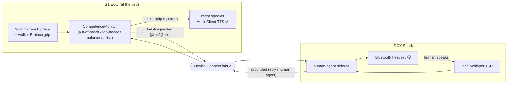

This keeps the issue's intent — *Device Connect orchestrates the human interaction* — while sidestepping
the closed on-board mic. And per Unitree engineering support (§6.1) the built-in array will *stay*
closed by design, so this isn't a stopgap: if a fully on-robot listen path is ever wanted, Unitree's
supported route is an **external USB-C mic/speaker array**, and the same coordination layer swaps the
sidecar's headset source for it with no logic change.

### 7.1 Built and verified live — both devices on the dashboard

This is no longer just a design. The real G1 EDU (**"Rabia"**) and a **Bluetooth Headset Human Agent**
both register on the hosted Device Connect fabric (`beta` tenant) and run the full loop end-to-end:
Rabia asks for help **out loud through her chest speaker**, invokes the human agent's `ask()` over
Device Connect, and the human's spoken answer — captured on the headset, transcribed by Whisper, and
grounded — comes back over the fabric with a `human_replied` event.

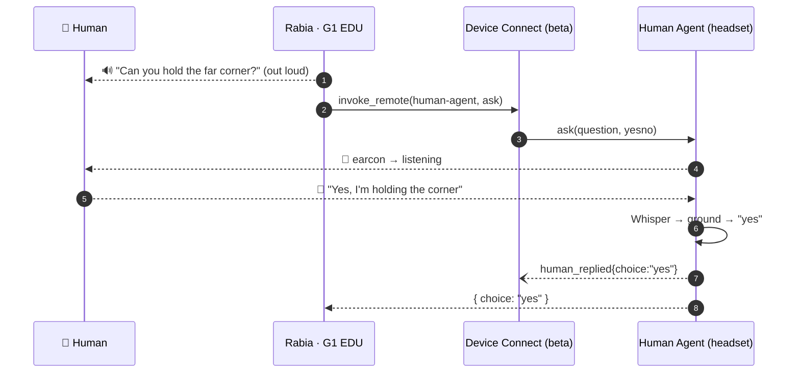

Both devices are live on the dashboard, each with its callable functions and event stream — the Human
Agent (`ask`/`notify`/`presence` + `human_replied`) and Rabia (`say`/`request_help`/`get_status` +
`help_requested`/`help_answered`):

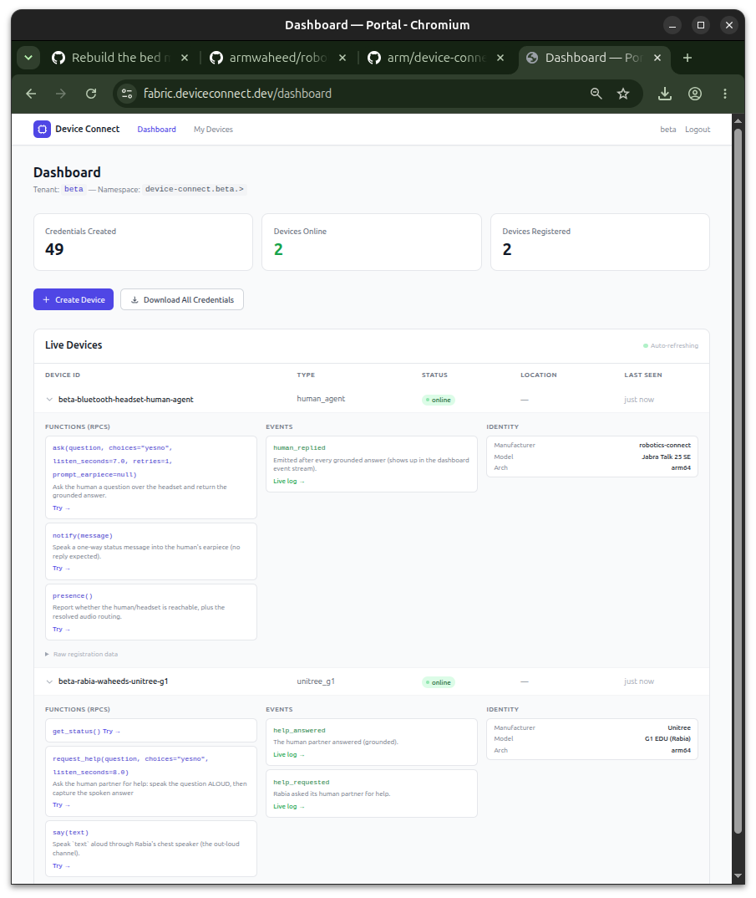

**Audio, validated on the real hardware.** A real answer captured over the Jabra Talk 25 SE (HFP mSBC,
16 kHz) — the energy VAD cleanly separates the speech from the robot's own (loud) cooling fan, and
faster-whisper transcribes it → grounded to `yes`:

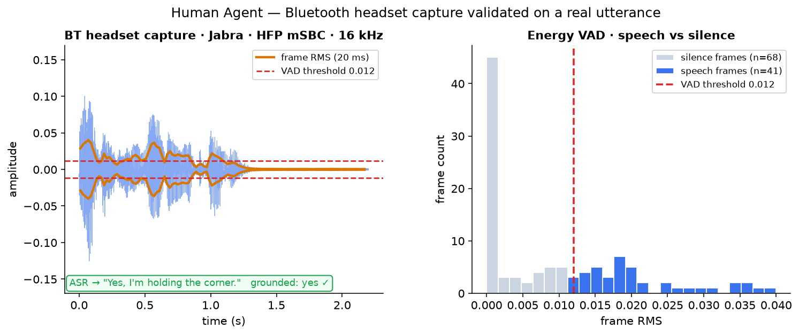

The end-to-end help loop is ~10.8 s (out-loud speak → listen + VAD → Whisper → ground + return), and
the robot's speaker master gain — dropped to 60 in a prior session, softening even the factory
announcements — is restored to full:

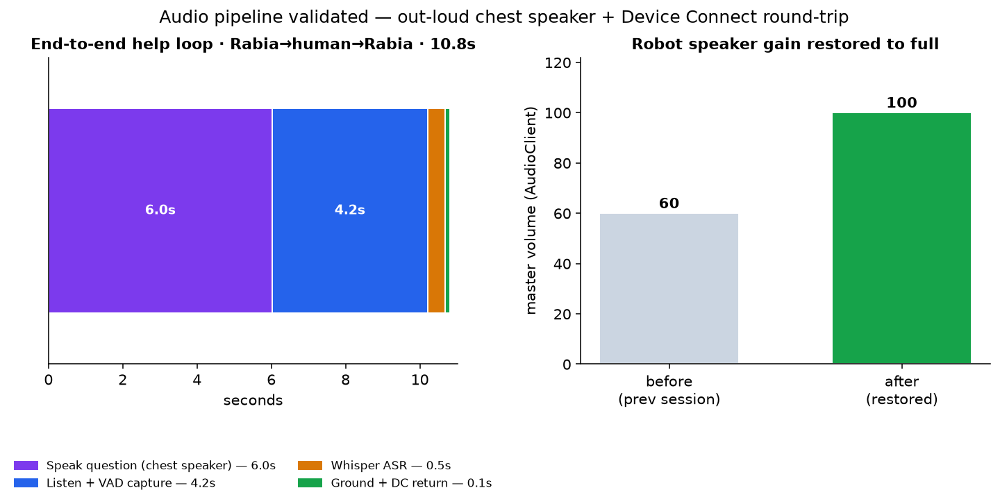

Because `device-connect-edge` needs Python ≥3.11 while the G1 SDK env is 3.10, the sidecar runs in a
clean 3.11 env and drives the chest speaker (the verified `AudioClient` path, §5) through a subprocess
**two-env bridge** — generalized as the `bootstrap-device-connect-env` skill in robotics-connect.

---

## 8. "Robot solo, asks when stuck" — the coordination

The behaviour layer ([`human_partner.py`](human_partner.py)) lets the robot attempt the whole bed and
**ask only when it leaves its competence envelope** — a competence monitor inspired by execution-time
failure prediction (BCVA, FAIL-Detect), with trip-points tied to *what the policy was actually trained
for*:

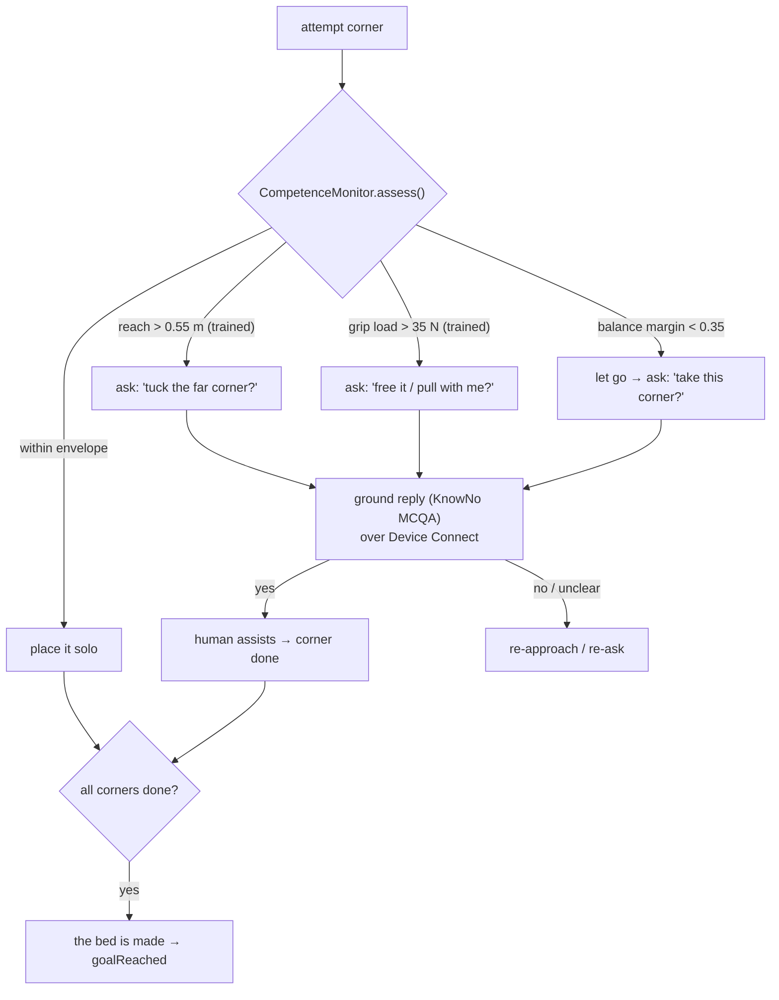

The spoken reply is grounded to a decision (KnowNo-style multiple-choice — "yeah go ahead" → `yes`),
and the whole dialogue + goal state are Device Connect events. Verified end-to-end in loopback (robot
does 2 corners solo, asks for the 2 it can't, human helps → "the bed is made").

---

## 9. Status & what's next

**Done + verified on hardware:** the transfer-valid 23-DOF policy (eye-verified), live LiDAR/RGB/depth
perception (LiDAR-first hand placement), the robot **speaking** (English TTS), and the **human-in-the-loop
help exchange running live over Device Connect** — Rabia and the Bluetooth Headset Human Agent both on
the dashboard, the out-loud ask → headset answer → grounded reply verified on the real hardware (§7.1).

**Next:**
1. Walk the robot to the bed (velocity-walk policy) and trigger the ask-when-stuck loop from the
   on-robot competence monitor (the help exchange itself is now verified live; what remains is wiring
   it to the walked-to-bed reach attempt).
2. Deploy the 23-DOF policy to the EDU (map Isaac ↔ SDK joint order for parity) for the bedside reach.
3. Brainco sensor-gated grip on the real sheet; sustained pull-load robustness (the open manipulation
   edge from the sim writeup).
4. The on-board mic is a settled question (§6.1): Unitree engineering support confirmed it is **not** a
   developer interface — built-in ASR only, or an external USB-C mic/speaker array for custom speech.
   The human loop intentionally doesn't depend on it; an external USB-C array stays an option if a
   fully on-robot listen path is ever wanted.

---

## 10. Hardware deploy — the de-risk ladder, an incident, and a transfer-robust retrain

The robot **walked to the bed** under closed-loop measured odometry (`rt/odommodestate`), controller-abort
armed, and made light contact with the wooden footboard while staying balanced (eye- + telemetry-verified:
IMU level, not leaning). Two vendor-interface gotchas surfaced and are now baked into the
[robotics-connect locomotion binding](https://github.com/armwaheed/robotics-connect): `LocoClient.BalanceStand`
needs a `balance_mode` argument on the current SDK (and only sets the mode — it does not stand the robot up),
and `Move(...)` must use `continous_move=True` or the gait re-ramps every re-issue into a ~0.03 m/s shuffle
that false-trips the stall guard (which is a *speed* check, not an obstacle sensor).

**The whole-body RL deploy was staged as a de-risk ladder** (full rationale in robotics-connect
[`SAFETY.md`](https://github.com/armwaheed/robotics-connect/blob/main/SAFETY.md)):

| Rung | Runs | Fall risk | Result |
|---|---|---|---|
| 0 — offline | obs+policy printed, no commands | none | **joint mapping verified on hardware** — predicted crouch offsets (knee +0.20, hip_pitch −0.17) landed on the named joints. The IsaacLab action order is **interleaved** (action idx 9 = `left_shoulder_pitch`, *between* the knees and ankles) — NOT the SDK 0–28 order; map by joint name. |
| 1 — arm-only | policy's arms via `rt/arm_sdk`, legs on vendor balance | none | smooth, bounded, abortable; IMU dead-steady — the policy→arm control path validated, fall-safe |
| 2 — whole-body | all 23 joints via `rt/lowcmd`, vendor balance released | **high** | transfer failed (the policy didn't balance) → **incident** |

**The incident (and the durable safety lesson).** On the gantry, the whole-body transfer failed and the
operator's controller-abort correctly damped it. The deploy process was still alive, so it was `kill -9`'d
"to stop the commands" — which **latched the last high-gain command on the motors** (DDS keeps applying the
last sample; on the G1 at sim gains, `kp` up to 150–200) with nothing left to update or damp it. The robot
**spin-kicked on the floor and broke an office window.** The fix is architectural, now shipped: **never
`kill -9` a low-level control process** — the safe stops are the hardware e-stop, the controller firmware-damp,
or a clean `kp=0` damp; every motor-command process must wrap its loop in
[`lib/safe_stop.py`](https://github.com/armwaheed/robotics-connect/blob/main/lib/safe_stop.py) (damps on
return/exception/SIGINT/SIGTERM). See [`SAFETY.md` §0](https://github.com/armwaheed/robotics-connect/blob/main/SAFETY.md).

**Why the transfer failed, and the fix.** The first transfer-robust retrain dropped `base_lin_vel` from the
observation (the real G1 can't observe its base linear velocity reliably) — but dropping it from **both** the
actor and the critic **starved the value function**, and `reach_coarse` peaked at 0.39 then *regressed* to
0.29 (ep-len ~210/400, topples ~30%). The research-backed fix is **asymmetric actor-critic**: keep
`base_lin_vel` (and other privileged terms) in a **critic-only** observation group while the **actor** drops it
and stays deployable (82-D). Retrained ("v2"): `reach_coarse` climbed **monotonically to 0.59**, ep-len
**394/400** (robust, barely topples), eye-verified upright + reaching at mid *and* end of the episode
([`media/rl/g1edu/bed_reach_v2_critic.mp4`](media/rl/g1edu/bed_reach_v2_critic.mp4)). The deployable actor is **82-D**
(no `base_lin_vel`); the deploy contract is dumped from the exact env by
[`rl/dump_deploy_contract.py`](rl/dump_deploy_contract.py) → `rl/deploy_contract_v2.json`. Deferred: actuator
**latency / motor-strength DR** (needs an actuator-model change — add only if hardware transfer is still marginal).

**The DGX Spark slowdown was a known GB10 bug, not the config.** A retrain ran 3.2× slower (213 vs 67 min,
same envs) — diagnosed not-thermal (40 °C), not CPU-bound (1/20 cores), not contention: the **GB10 GPU was
trapped in a low-power state**, pinned at **507 MHz / 6 W under 80% load** (vs a 2418 MHz app clock). It is a
[documented Spark firmware bug](https://forums.developer.nvidia.com/t/dgx-spark-grace-blackwell-gb10-performance-drop-gpu-trapped-in-15w-650mhz-loop-with-50-c-artificial-t-limit-temp/370304);
the **only** fix is a **full AC power cycle** (unplug from the wall ≥60 s — a normal reboot does not clear it).
After the power cycle the GPU boosted to **2541 MHz / 97 W** and v2 trained in 67 min. **Lesson: check the GPU
clock-vs-max before blaming a config change.**

## 11. Research, forums & references

**Sim-to-real RL — observation & training:**
- Asymmetric actor-critic / privileged critic (keep `base_lin_vel` in the critic, drop from the actor):
  [Isaac Lab — Sim-to-Real Policy Transfer](https://isaac-sim.github.io/IsaacLab/main/source/experimental-features/newton-physics-integration/sim-to-real.html)
  (teacher/student privileged-obs pattern); rsl-rl `critic` obs group.
- Obs-layout / joint-order parity is the #1 G1 deploy footgun: [IsaacLab #4037](https://github.com/isaac-sim/IsaacLab/issues/4037).
- [Real-world humanoid locomotion with RL — Science Robotics](https://www.science.org/doi/10.1126/scirobotics.adi9579);
  [Learning Sim-to-Real Humanoid Locomotion in 15 Minutes (arXiv 2512.01996)](https://arxiv.org/pdf/2512.01996);
  [Booster Gym (arXiv 2506.15132)](https://arxiv.org/pdf/2506.15132); [Unitree `unitree_rl_lab`](https://github.com/unitreerobotics/unitree_rl_lab).

**Whole-body loco-manipulation & reward design (reach while balancing):**
- [FALCON — Force-Adaptive Humanoid Loco-Manipulation (arXiv 2505.06776)](https://arxiv.org/abs/2505.06776)
  (dual-agent: lower-body balance under force + upper-body EE tracking);
  [SkillBlender (arXiv 2506.09366)](https://arxiv.org/html/2506.09366); HOVER / ExBody2;
  [Kinematics-Aware Multi-Policy (arXiv 2511.21169)](https://arxiv.org/pdf/2511.21169).
- Reward design trend: robust behaviors emerge from **<10 terms** vs heavy 20+-term shaping — judge by
  `reach_coarse` + ep-len + the render, not the regularizer-dominated mean reward.

**Domain randomization (sim-to-real dynamics gap):**
- Motor strength / offset / lag like IsaacGym: [IsaacLab Discussion #2895](https://github.com/isaac-sim/IsaacLab/discussions/2895)
  (`isaaclab.utils.buffers.DelayBuffer`, `DelayedPDActuatorCfg`); [DR tips for legged locomotion #2813](https://github.com/isaac-sim/IsaacLab/discussions/2813).
- Friction + actuator delay are the *critical* terms; [DrEureka — LLM-guided DR (arXiv 2406.01967)](https://arxiv.org/pdf/2406.01967).

**DGX Spark / GB10 (training throughput):**
- [Arm — Isaac Lab RL on DGX Spark](https://learn.arm.com/learning-paths/laptops-and-desktops/dgx_spark_isaac_robotics/4_isaac_rfl/)
  (~1.5 s/iter, 40–60k fps, 2048–4096 envs, `--headless`, `LD_PRELOAD=…libgomp.so.1`).
- GPU stuck-low-power bug + AC-cycle fix: [NVIDIA forum 370304](https://forums.developer.nvidia.com/t/dgx-spark-grace-blackwell-gb10-performance-drop-gpu-trapped-in-15w-650mhz-loop-with-50-c-artificial-t-limit-temp/370304) ·
  [367768](https://forums.developer.nvidia.com/t/gb10-gpu-power-stuck-around-37w-when-running-llms-gemma-4-26b-qwen-3-6-27b/367768) ·
  [step-by-step fix](https://dredyson.com/fix-dgx-spark-performance-degradation-gpu-power-draw-issue-in-under-5-minutes-actually-works-a-complete-step-by-step-beginners-guide-to-resolving-the-14w-power-cap-low-token-rate-and-stuck-pe/) ·
  [spark-doctor diagnostic](https://github.com/joeynyc/spark-doctor). Blackwell `sm_121` slow NVRTC paths → Isaac Sim source build w/ CUDA 13 (general speedup; not the stuck-clock cause).

**Help-seeking, failure-detection & perception (the human-partner loop):**
- [KnowNo — conformal MCQA grounding (arXiv 2307.01928)](https://arxiv.org/abs/2307.01928) (the ask-reply grounding);
  BCVA (arXiv 2302.04334) / [FAIL-Detect (arXiv 2503.08558)](https://arxiv.org/abs/2503.08558) (execution-time "ask-when-stuck" trigger, no failure data needed);
  Ask-to-Act (arXiv 2504.00907).
- Cloth/bed vision: Seita et al. 2019 (depth > RGB on textureless bedding) → LiDAR-first hand placement;
  VIRAL (arXiv 2511.15200) visual DR.
- Drift-free localization for the walk: [Point-LIO (Unitree LiDAR)](https://github.com/unitreerobotics/point_lio_unilidar) /
  [FAST-LIO localization for the G1](https://github.com/deepglint/FAST_LIO_LOCALIZATION_HUMANOID).

*Hardware: Unitree G1 EDU (23-DOF, Brainco hands) · NVIDIA DGX Spark (GB10). Physically valid for
sim-to-real — no base pinning / teleporting / joint freezing. Built with Claude Code (Opus 4.8).*
