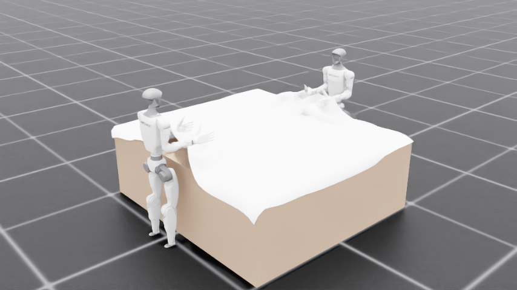
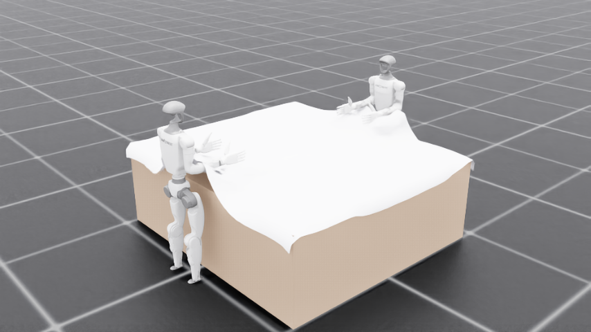

# Two Unitree G1s make a bed in NVIDIA Isaac Sim — coordinated over Arm Device Connect

Two **Unitree G1 humanoids** (with **Inspire 5‑finger hands**) make a bed in
**NVIDIA Isaac Sim / Isaac Lab**, driven by **real teleoperated motion** replayed
from Unitree's bed‑making dataset and coordinating as **equal peers over Arm
Device Connect** — instead of "head‑nodding," they ask each other for help and
offer help over a real Device Connect swarm.

This is a self‑contained example: it does **not** modify the `strands_robots`
product package or Arm's Device Connect. It reuses the swarm driver from
[`examples/unitree_g1_bed_making_g1_driver.py`](../unitree_g1_bed_making_g1_driver.py).



| Sheet drapes onto the bed | The bed, made |
| --- | --- |
|  |  |

A full headless run renders **242 frames → [`media/isaac_bed_making.mp4`](media/isaac_bed_making.mp4)**.

## What it shows

* **Real, physically‑simulated cloth.** A thick PhysX particle‑cloth "duvet"
  drapes over the bed under gravity and is gripped by the robots' hands — not a
  scripted animation.
* **Friction grasping, no cheating.** The hands have a high‑friction "rubberized"
  material; the cloth is gripped by **contact friction**, with **no kinematic
  attachment / pinning**. Cloth‑on‑bed friction is tuned independently so the
  sheet drapes and grips without sliding off.
* **Real motion from teleoperation data.** The waist (3 DOF) and both arms (7 DOF
  each) are driven directly from a recorded trajectory of a *real* teleoperated
  Unitree G1 making a bed — not scripted waypoints. See
  [Real motion from teleoperation data](#real-motion-from-teleoperation-data).
* **Equal‑peer swarm coordination over Device Connect.** Both G1s pursue the goal
  state *"the bed is made"*; they claim work, emit events, and ask for / offer
  help. With `--broker` both peers register live on the Device Connect dashboard
  with callable functions and an event stream.

## Real motion from teleoperation data

The bed‑making motion is **replayed from real data**, not hand‑authored. Source:
[`unitreerobotics/G1_WBT_Brainco_Make_The_Bed`](https://huggingface.co/datasets/unitreerobotics/G1_WBT_Brainco_Make_The_Bed)
— 300 episodes of a real teleoperated Unitree G1 making a bed (LeRobot **v3.0**,
Apache‑2.0).

Because the sim uses the **actual Unitree G1 model**, the recorded joint angles
transfer **1:1** — no angle‑convention conversion:

* `action.robot_q_desired` is `[7 root pose] + [29 G1 joint targets]` in the
  canonical Unitree G1 order, so the **waist** (`q[19:22]`) and **both arms**
  (`q[22:29]`, `q[29:36]`) map straight onto the same‑named sim joints and are
  driven as joint position targets each frame.
* The **waist's full 3 DOF** are reproduced — `waist_yaw` (twisting),
  `waist_roll` (lateral bending) and `waist_pitch` (forward–backward bending) —
  so the torso twist and lean are the robot's own recorded motion.
* The dataset hand is **BrainCo** (12‑motor) and the sim hand is **Inspire**
  (also 12‑motor) but the finger order differs; `action.hand_cmd` is retargeted
  per‑finger to the Inspire close fractions.

`tools/extract_trajectory.py` pulls one episode, isolates the **manipulation
window** (after the robot has walked up to the bed — the walk‑up is a separate
roadmap item, the RL approach), and writes the compact `data/bed_making_traj.npz`
the demo replays. The two sim peers replay the same trajectory; robot 1's 180°
spawn rotation makes it a **mirrored peer**, and `--lag` desynchronises them so
they read as two independent agents.

Regenerate the trajectory from the dataset (needs `pip install pyarrow
huggingface_hub numpy`; not needed just to run the demo):

```bash
python examples/isaac_bed_making/tools/extract_trajectory.py --episode 4
```

> **Note (fixed base):** the robots are currently planted (fixed‑base) so a fixed
> arm can reach the bed. The real robot also bent its hips/knees to lower its
> hands; with the legs pinned, that share of the reach shows up as a stronger
> torso lean. Freeing the base + a learned approach‑walk is the next roadmap item.

## Run it

On the DGX Spark, with Isaac Lab:

```bash
cd ~/workspaces/git/IsaacLab
export LD_PRELOAD="$LD_PRELOAD:/lib/aarch64-linux-gnu/libgomp.so.1"   # aarch64 caveat
PYTHONUNBUFFERED=1 ./isaaclab.sh -p \
    ~/workspaces/git/robots/examples/isaac_bed_making/demo.py --loopback --render
```

Modes:

| Flag | Effect |
| --- | --- |
| `--loopback` | Coordinate via an in‑process bus (offline, default). |
| `--broker` | Register both peers on the real Device Connect NATS fabric (`.credentials/`). |
| `--no-device-connect` | Skip Device Connect entirely. |
| `--render` | Capture frames and encode an mp4 into `artifacts/isaac_bed_making/`. |
| `--scripted` | Use the legacy scripted reach/drag waypoints instead of the dataset replay. |
| `--replay-speed F` | Playback speed of the recorded motion (`1.0` = real time). |
| `--lag S` | Seconds robot 1 trails robot 0 in the replay (default `0.4`). |

## How it works (and two gotchas worth knowing)

* **Cloth = a *quad* grid, not triangles.** Isaac's auto particle‑cloth turns
  every mesh edge into a stiff stretch spring, so a *triangulated* grid makes the
  cell diagonals inextensible and the sheet locks into a rigid plate. With
  **quads**, the diagonal becomes a soft *shear* spring and the cloth drapes.
  Springs are kept elastic for the same reason.
* **The GPU pipeline doesn't sync cloth deformation to the renderer.** With
  Fabric on (or off) on the GPU PhysX pipeline, deformed particle positions are
  not written back to the USD mesh, so a headless camera renders the *flat,
  authored* mesh while the cloth actually drapes in the backend. The demo runs
  with `use_fabric=False` and reads the live positions from a **PhysX tensor
  cloth‑view**, blitting them into the visual mesh each frame.

## Files

| File | Role |
| --- | --- |
| `demo.py` | Entry point: builds the scene, runs the DC‑coordinated bed‑making sequence, renders. |
| `replay.py` | Drives the waist + arms (+ Inspire fingers) from the recorded dataset trajectory. |
| `tools/extract_trajectory.py` | Regenerates `data/bed_making_traj.npz` from the Unitree dataset. |
| `data/bed_making_traj.npz` | Extracted real bed‑making trajectory (episode 4 manipulation window). |
| `scene.py` | Scene geometry — two planted G1s + bed + camera + sheet parameters. |
| `cloth.py` | PhysX particle‑cloth bedsheet (quad grid, elastic, thick) + tensor‑view read/blit for rendering. |
| `manipulation.py` | World‑frame differential‑IK arm driver + `apply_hand_friction` (rubberized hands); used by `--scripted`. |
| `coordination.py` | In‑process Device Connect swarm (loopback / real broker), wrapping the shared swarm driver. |
| `behavior.py` | Per‑robot autonomous decision state machine (scaffolding for emergent ordering). |
| `coverage.py` | "Good‑enough" coverage metric scaffolding (to be reworked for head‑mounted cameras). |

## Status

The cloth physics, Inspire hands, friction grasping, Device Connect swarm,
rendering, **and the real‑data motion replay** all work end‑to‑end. The scripted
press/drag choreography has been **replaced by the dataset replay** (kept behind
`--scripted` for comparison).

Next on the roadmap (see the issue #2 continuation comment): a learned
**RL approach‑walk** so the robots start off the bed and step in (and the legs
absorb their share of the reach); **head‑mounted‑camera coverage** reported over
Device Connect; a tolerant **"good‑enough" goal**; and, as a stretch, training an
**imitation‑learning policy** on the dataset rather than replaying it.
