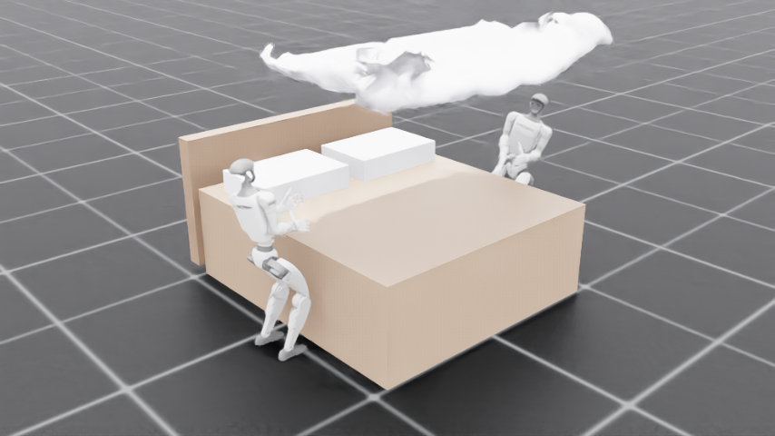
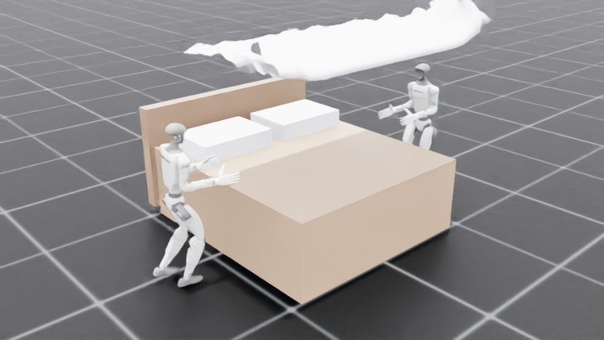
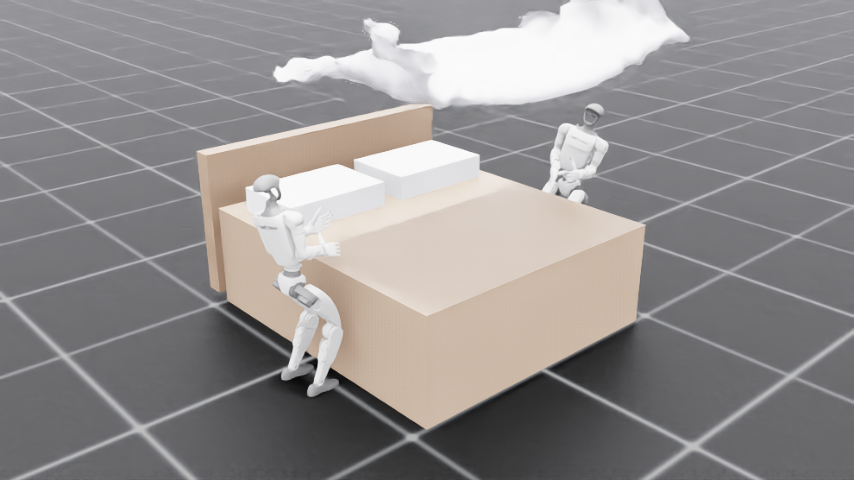

# Two Unitree G1s make a bed in NVIDIA Isaac Sim — coordinated over Arm Device Connect

Two **Unitree G1 humanoids** (with **Inspire 5‑finger hands**) **walk up to a bed
under a learned RL locomotion policy** and make it together in **NVIDIA Isaac Sim /
Isaac Lab**, coordinating as **equal peers over Arm Device Connect** — instead of
"head‑nodding," they claim work and ask each other for / offer help over a real
Device Connect swarm.

This is a self‑contained example: it does **not** modify the `strands_robots`
product package or Arm's Device Connect. It reuses the swarm driver from
[`examples/unitree_g1_bed_making_g1_driver.py`](../unitree_g1_bed_making_g1_driver.py).



| Walk in (learned policy) | Lean + reach (Pink IK arm + waist) |
| --- | --- |
|  |  |

A full headless run renders an mp4 to **[`media/isaac_bed_making.mp4`](media/isaac_bed_making.mp4)**.

## What it shows

* **Official, sim‑to‑real locomotion walk‑in.** Each G1 starts ~1.6 m off its side of
  the bed and **walks in on Unitree's official
  [`unitree_rl_lab`](https://github.com/unitreerobotics/unitree_rl_lab) G1 velocity‑walk
  policy** — a pretrained, Isaac‑Lab‑native whole‑body RL policy that Unitree ships to
  deploy on real G1s. We reproduce its exact 480‑dim observation, joint order and PD gains
  from the policy's own deploy config, and run the MLP **on the GPU via torch** (the DGX
  Spark has no onnxruntime GPU provider). Two G1s stride to the bedside, upright.
* **Free‑standing balance — no kinematic cheats.** This is the heart of the example: the
  robots are **free‑base articulations** that stand, walk and reach **entirely under their
  controllers**. There is **no base pinning, no teleporting, no joint freezing** — every
  motion is one a real G1 could reproduce on hardware. At the bedside the velocity policy
  keeps **balancing the legs in place** while the arms work.
* **Established G1 manipulation IK (NVIDIA Pink/Pinocchio).** Each robot reaches with
  **Isaac Lab's `pink_ik` controller** — a weighted‑QP IK over the **arm *and* the 3‑DOF
  waist** — while the policy balances underneath.
* **Real, physically‑simulated cloth.** A PhysX particle‑cloth sheet drapes over the bed
  under gravity (the "MuJoCo recipe": featherlight + coarse + thick) with a render‑side
  shell for visual thickness — not a scripted animation.
* **Equal‑peer swarm coordination over Device Connect.** Both G1s pursue the goal state
  *"the bed is made"*; they claim work, emit events, and ask for / offer help. With
  `--broker` both peers register live on the Device Connect dashboard.

## Status — physically valid, with one known gap

The whole point of an Isaac Sim demo is **sim‑to‑real**: every motion must be something a
real robot could do. So this example refuses kinematic shortcuts. What that buys, and what
it costs, today:

* ✅ **Walk‑in works** — the official velocity policy stands and strides on its own (GPU).
* ✅ **Free‑standing bedside balance works** — pelvis steady ~0.79 m, feet planted, the
  policy balancing the legs with nothing held.
* ⚠️ **Sustained bed‑making reach is WIP.** A deep bend‑over‑the‑bed reach shifts the
  centre of mass past what a *walking*‑balance policy can hold, so the robots topple on the
  deep reach (they take recovery steps backward and fall). A free‑standing humanoid needs
  **whole‑body loco‑manipulation** to manipulate without falling — coordinating the reach
  with the torso/legs. The roadmap: (1) a **push/drag‑while‑walking** strategy ("Toil
  Mode") that uses the policy's *walking* strength to move the sheet, then (2) a **trained
  loco‑manipulation RL policy** for the full motion. We deliberately do **not** pin or
  fix the base to hide this — that would make the sim a cartoon and break sim‑to‑real.

## Adapting NVIDIA's Pink IK to the Inspire hand

Isaac Lab's `pink_ik` controller ships configured for the **Dex3** 3‑finger G1, but
this demo requires the **Inspire** 5‑finger USD. The controller maps the URDF onto
the sim robot **by joint name over the full joint set**, so three things were needed
(all bundled, self‑contained):

1. **A matching URDF.** `unitree_ros`'s
   `g1_29dof_rev_1_0_with_inspire_hand_DFQ.urdf` has the **same 53 actuated joint
   names** as the Isaac Lab Inspire USD. We ship a **kinematics‑only** copy
   (`assets/g1_inspire_kin.urdf`, visual/collision geometry stripped — Pinocchio
   needs only the kinematic tree, and it avoids a mesh‑loading binding bug).
2. **Import order.** `eigenpy`/`pinocchio` must be imported **before** the Isaac
   app launches, or the app shadows eigenpy's string‑vector converter and the
   controller fails to build. `demo.py` does this at the top.
3. The waist (3 DOF) is added to the IK so the torso can lean into the reach.

## Run it

On the DGX Spark, with Isaac Lab:

```bash
cd ~/workspaces/git/IsaacLab
export LD_PRELOAD="$LD_PRELOAD:/lib/aarch64-linux-gnu/libgomp.so.1"   # aarch64 caveat
PYTHONUNBUFFERED=1 ./isaaclab.sh -p \
    ~/workspaces/git/robots/examples/isaac_bed_making/demo.py --loopback --render
```

Modes:

| Flag | Effect |
| --- | --- |
| `--loopback` | Coordinate via an in‑process bus (offline, default). |
| `--broker` | Register both peers on the real Device Connect NATS fabric (`.credentials/`). |
| `--no-device-connect` | Skip Device Connect entirely. |
| `--gui` | Open the Isaac Sim window to watch live (instead of headless). |
| `--render` | Capture frames and encode an mp4 into `artifacts/isaac_bed_making/`. |
| `--no-walk` | Skip the learned approach‑walk (start at the bedside). |
| `--walk-only` | Stop after the approach‑walk (to inspect locomotion). |
| `--replay` | Make the bed with the **dataset motion replay** instead of closed‑loop Pink IK. |
| `--replay-speed F` / `--lag S` | Replay playback speed / robot‑1 trail (with `--replay`). |

## Optional: real motion from teleoperation data (`--replay`)

With `--replay`, the waist + both arms are driven from a recorded trajectory of a
*real* teleoperated Unitree G1 making a bed — Source:
[`unitreerobotics/G1_WBT_Brainco_Make_The_Bed`](https://huggingface.co/datasets/unitreerobotics/G1_WBT_Brainco_Make_The_Bed)
(LeRobot v3.0, Apache‑2.0). Because the sim uses the actual Unitree G1 model, the
recorded joint angles transfer 1:1. `tools/extract_trajectory.py` pulls one episode
and writes the compact `data/bed_making_traj.npz` the demo replays. Regenerate it
(needs `pip install pyarrow huggingface_hub numpy`; not needed just to run the demo):

```bash
python examples/isaac_bed_making/tools/extract_trajectory.py --episode 4
```

## Rendering: cloth and robot together (the gotcha)

The robot articulation only renders its motion with **Fabric on** (Isaac Lab pushes
link poses to the renderer only when `use_fabric=True`), but PhysX does **not** sync
particle‑cloth deformation to Fabric. Per NVIDIA's forums, *mesh* updates do cross
Fabric (only point‑instancer ones don't), and our bedsheet is a `UsdGeom.Mesh`. So
the demo runs with `use_fabric=True` and **blits the live cloth positions** (read
from a PhysX tensor cloth‑view) **into the Fabric mesh points** each render — both
the moving robot and the deforming sheet show at once.

The cloth is built as a **quad** grid (not triangles): Isaac's auto particle‑cloth
turns every mesh edge into a stiff stretch spring, so a triangulated grid locks into
a rigid plate, while quads leave the diagonal as a soft shear spring and it drapes.

## Files

| File | Role |
| --- | --- |
| `demo.py` | Entry point: scene, learned walk‑in, base pin, Pink‑IK bed‑making, Device Connect, render. |
| `locomotion.py` | `RLGymWalker` (Unitree rl_gym walk) + `LocomotionPolicy` (agile balance stance) + floating‑base setup. |
| `manipulation.py` | `PinkArmIK` (NVIDIA Pink IK, arm + waist) + `apply_hand_friction` (rubberized hands). |
| `cloth.py` | PhysX particle‑cloth bedsheet (quad grid) + tensor‑view read + Fabric/usdrt blit for rendering. |
| `scene.py` | Scene geometry — two walk‑in G1s + bed + headboard + pillows + camera + sheet parameters. |
| `replay.py` | (`--replay`) Drives waist + arms (+ Inspire fingers) from the recorded dataset trajectory. |
| `coordination.py` | In‑process Device Connect swarm (loopback / real broker), wrapping the shared swarm driver. |
| `behavior.py` | Per‑robot autonomous decision state machine (scaffolding for emergent ordering). |
| `assets/g1_inspire_kin.urdf` | Kinematics‑only Inspire G1 URDF for the Pink IK solver. |
| `policies/g1_rlgym_walk.pt` | Unitree `unitree_rl_gym` G1 walk policy (BSD‑3) + its `.yaml` deploy config. |
| `data/bed_making_traj.npz` | Extracted real bed‑making trajectory (used by `--replay`). |

## Status

The learned walk‑in, the render reconciliation (robot + cloth both render), the
upright base‑pin manipulation, the NVIDIA Pink IK (arm + waist) reach, the friction
grasp, the cloth physics, and the Device Connect swarm all work end‑to‑end and are
verified by watching rendered frames.

**Known next step:** the sheet does not yet end up spread convincingly flat — it
starts folded back at the foot and the current grasp‑and‑pull doesn't fully flatten
it over the mattress. This is cloth‑geometry / manipulation‑strategy tuning (the IK
itself converges); a both‑hands grab + larger spread is the planned follow‑up.

Other roadmap items (see the issue #2 continuation comments): head‑mounted‑camera
coverage reported over Device Connect; a tolerant "good‑enough" goal; and, as a
stretch, an imitation‑learning policy trained on the dataset rather than replayed,
and a fully Isaac‑Lab‑native (`unitree_rl_lab`) walk once its rsl_rl version is
reconciled.
