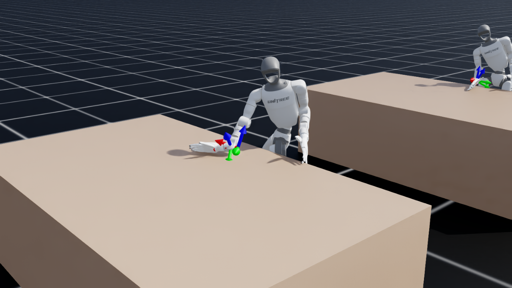
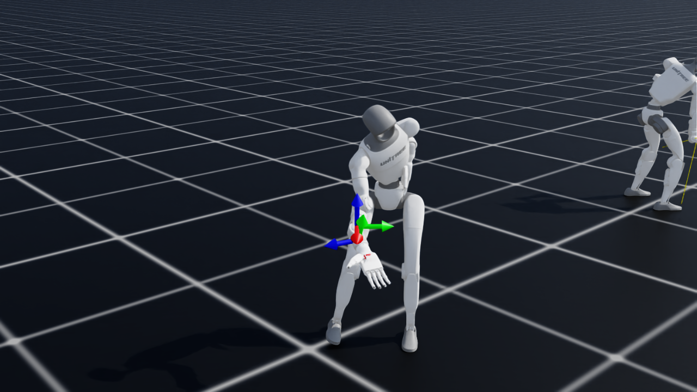
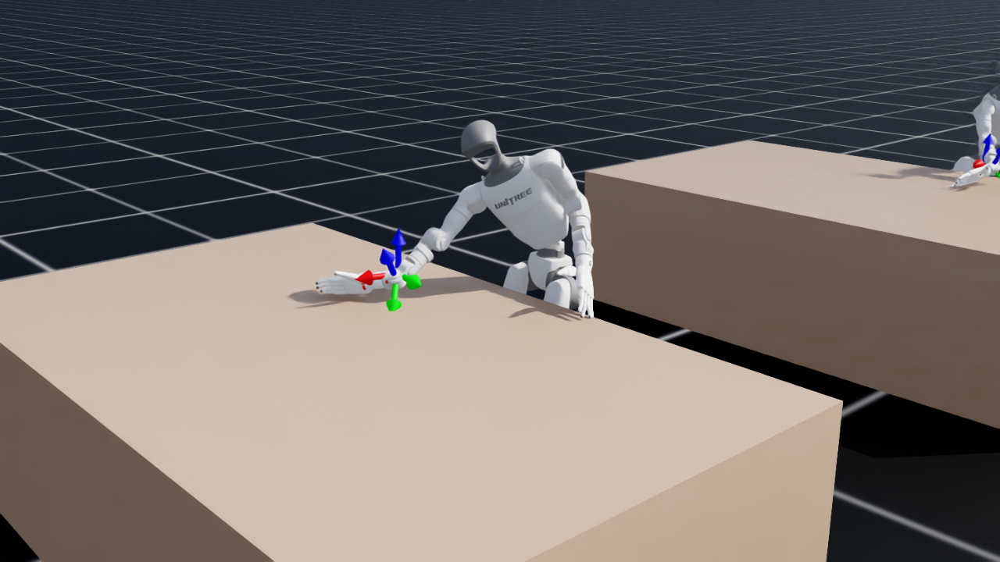
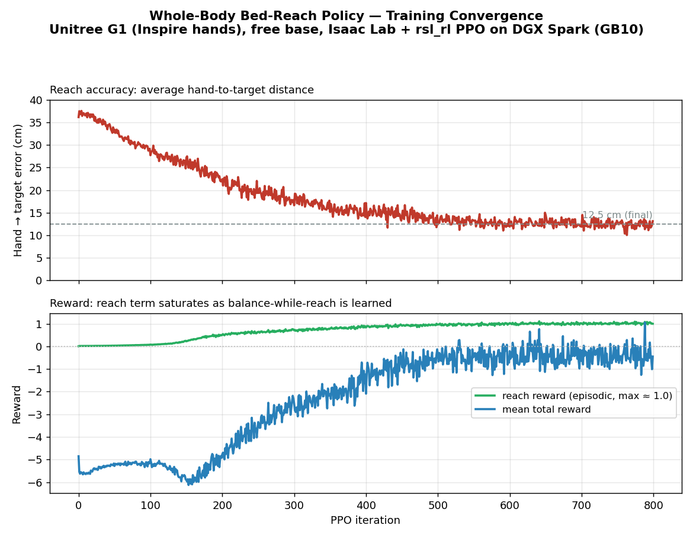

# Whole-Body Loco-Manipulation RL for Bed-Making — Unitree G1 on NVIDIA DGX Spark

> Teaching two **free-standing Unitree G1 humanoids (Inspire 5-finger hands)** to **balance on their
> own two feet while bending over a bed and pulling a sheet** — the loco-manipulation skill a walking
> policy cannot hold. Trained end-to-end in **NVIDIA Isaac Lab** on a **DGX Spark (GB10, aarch64)**.
>
> Just as important as the robot: **how it was built.** This is an *engineering* project, not a
> research one — the goal was to **apply** existing robot-learning research to one concrete problem,
> not to invent a new method. See [§1](#1-the-engineering-approach).



*The current policy: a free-base G1 leans over the bedside — feet planted outside the bed, knees
against it — to reach a target on the mattress, balancing entirely on its own (no base pinning, no
teleporting, no joint freezing).*

**🎬 Policy video (current iteration):** [`media/rl/bed_pull_policy.mp4`](media/rl/bed_pull_policy.mp4)
&nbsp;•&nbsp; **Deployable policy (committed):** [`rl/policy/policy.onnx`](rl/policy/policy.onnx) · [`rl/policy/policy.pt`](rl/policy/policy.pt)

> **This is a living document.** It tracks the policy as it evolves toward a fully working two-G1
> bed-making demo. It currently covers two iterations (free-space reach → planted bed-pull) and will be
> updated at the next step. See [§9](#9-status--whats-next).

---

## 1. The engineering approach

There are two ways to attack a hard robotics problem. A **researcher** asks *"what new method could
solve this?"* and sets out to discover one. An **engineer** asks *"whose already-solved pieces can I
assemble into a working system for my specific problem?"* — and treats inventing something novel as a
last resort, not a first move. **This project is deliberately the engineer's path.**

Almost every hard part below was solved by **reusing existing work and adapting it**:

- The whole-body balance-while-reach formulation rides **Isaac Lab's native locomotion RL rails** and
  the **rsl-rl** PPO recipe — we reformulated "track a velocity" into "reach a hand target," not a new
  algorithm.
- Making the robot **hold a load / survive the sheet slipping** is **force-adaptive whole-body control**
  straight out of the recent literature (**FALCON**, and the unified position/force loco-manipulation
  work) — applied as an external-force domain-randomization term.
- The **two-stage shaping** (learn to reach + balance first, *then* add force disturbances) is the
  pattern in **NVIDIA's Isaac Lab 2.3 Whole-Body Control** and **GR00T N1.6** writeups.
- The **free-base Inspire-hand robot**, the **rsl_rl config-schema fix**, and the **headless video**
  workaround all came from specific **NVIDIA forum threads, GitHub issues, and a published PR**
  ([§5](#5-the-research--resources-we-reused)).

**Why this matters for applied physical AI — the human/AI division of labour.** Working with a partner
AI (Claude Code) made a clean split natural, and it is the split that scales:

| The **human engineer** owns the *abstract* problem-solving | The **partner AI** owns the *implementation* problem-solving |
|---|---|
| What to build; which research applies; the physics/architecture decisions (e.g. *"keep the feet planted — that's the bug,"* *"a sustained pull-load is the next gap"*) | Writing the Isaac Lab env, reverse-engineering the 151-D observation, wiring obs↔action, debugging launches, running and babysitting training jobs |
| Judgement: **verify by what the human sees** (rendered video), reject over-claims, decide the next iteration | Generating the candidate fix, the probe scripts, the convergence plots, this document |

The scarce resource in physical AI is **human reasoning about the physical world**. Pushing the
*computational and implementation* burden onto the AI lets that reasoning be spent on the decisions
that actually need a human — which research to apply, what "working" looks like, and where the real
gap is — and lets one engineer move at the pace of a team.

---

## 2. The problem (why it's hard)

Two G1s making a bed must **lean out over the mattress and pull a sheet** — a deep forward-and-down
reach. A locomotion (walking) policy keeps the robot upright *while walking*, but the instant it bends
to reach over the bed, the **centre of mass travels past the feet and the robot topples.** We confirmed
this every other way first:

- A stationary **inverse-kinematics stand-and-reach** topples on the sustained lean.
- A **drag-while-walking** strategy snags or launches the robot when the hand grips the cloth.
- The official **velocity-walk policy** balances beautifully while striding but cannot hold the bend.

The fix is a **single whole-body policy that owns balance *and* reach at once** — legs/ankles
counter-lean, the waist bends, the arm extends, all learned together so the reach never becomes a fall.

> **Methodology rule held throughout:** *verify by what the human sees* (rendered video), never by
> reward telemetry alone. Every claim below is eye-verified.

---

## 3. The policy, in two iterations

### 3.1 Iteration 1 — whole-body *free-space* reach (the intermediate step)

The first policy learned to **balance on a free base while reaching a hand target sampled in a
forward-and-down cone** (no bed in the scene). It worked: the G1 squats and leans to targets from chest
height to near the floor and **never topples** — reach error converged **37 cm → ~12 cm**.

 &nbsp; *(full clip: [`media/rl/bed_reach_policy.mp4`](media/rl/bed_reach_policy.mp4))*

**Why it was only a stepping stone.** It proved balance-while-reach is learnable — but it had **no
incentive to keep its feet planted.** In free space it was free to *step* toward a target to stay
balanced. Put it beside a real bed (feet outside, reaching *over* the mattress) and it does exactly
that: reaching forward shifts the CoM forward, so it **steps backward** to recover, the fixed sheet
target then sits even farther forward in its receded frame, it leans harder — and it **walks itself off
its spot and topples.** The missing ingredient was *staying planted*.

### 3.2 Iteration 2 — *planted bed-pull* (current policy)

The current policy keeps the same balance-while-reach core and adds exactly what was missing for a
**bedside** reach — each piece an application of reused research:

| Added this iteration | What it does | Reused from |
|---|---|---|
| **Station-keeping reward** | Penalises the base drifting off its spawn spot → it reaches by *leaning/squatting with planted feet*, not by stepping away. The fix for the walk-off. | standard locomotion reward shaping |
| **Bed as a collision obstacle** in front | The robot must bend *over* the bedside (feet outside, knees against it) — the real constraint a free-space policy never feels. | — (the deployment scene, brought into training) |
| **Grip-slip / sheet-tension load** | A random horizontal force on the hand that **toggles on and off** → the policy learns to absorb a *sudden* load change without toppling ("don't fall when the sheet slips or you let go"). | **FALCON** force-adaptive WBC; **unified position/force** loco-manip; Isaac Lab 2.3 force-disturbance curriculum |
| **Wider reach + drag workspace** | Targets span forward **and both lateral sides** → the planted policy can reach *and drag headward* in any needed direction. | — |
| **Natural idle-arm regularizer** | Keeps the non-reaching arm from contorting into an uncanny counter-balance (small counter-motions still allowed). | standard posture regularization |

**Result (eye-verified, [§4](#4-result-eye-verified-current-policy)):** the G1 **leans over the bed,
stays planted at the edge, holds the toggling grip-slip load, and reaches targets across the surface —
forward and lateral — without toppling.** Reach error tightened to **~6 cm**.

---

## 4. Result (eye-verified, current policy)

Across the full clip the policy reaches targets on and above the bed surface (forward **and** lateral —
the headward drag direction), **balancing on its own feet and staying planted at the bedside the entire
time.**

| Lean over the bedside | Lateral reach (drag direction) |
|---|---|
|  |  |

🎬 **[`media/rl/bed_pull_policy.mp4`](media/rl/bed_pull_policy.mp4)** — 350 frames, no topple.

**Convergence** (2048 envs, 1000 PPO iterations, ~30 min on one GB10):

- Hand→target error: **~37 cm → ~6 cm**
- Base drift (station-keeping): small and stable → **stays planted**
- Falls: rare, even with the grip-slip load toggling → **balance holds through the load change**

*(The iteration-1 convergence curve is below for reference — same training rig, before the bedside
additions.)*



> **Honest caveats.** ~6 cm is *near*, not pinpoint. And this is the **policy in isolation** — wiring it
> into the full two-G1 demo with the real particle-cloth sheet is in progress: one robot already reaches
> and grips the sheet *while staying planted* (the fix working in context), but the **sustained** pull
> against the cloth still over-loads the policy, and one robot falls asymmetrically. Those are the next
> iteration ([§9](#9-status--whats-next)) — and a good example of *not over-claiming.*

---

## 5. The research & resources we reused

The heart of the engineering approach: **almost nothing here was invented — it was found and applied.**

**Research papers (the force-adaptive / whole-body-control ideas we applied)**
- **FALCON: Learning Force-Adaptive Humanoid Loco-Manipulation** — adapting a whole-body policy to
  hand-force loads. *This is the basis for the grip-slip / sheet-tension training.*
  [arXiv 2505.06776](https://arxiv.org/abs/2505.06776)
- **Learning a Unified Policy for Position and Force Control in Legged Loco-Manipulation** —
  [arXiv 2505.20829](https://arxiv.org/abs/2505.20829)
- **AdaptManip: Adaptive Whole-Body Object Lifting with Online State Estimation** —
  [arXiv 2602.14363](https://arxiv.org/abs/2602.14363)
- **NVIDIA Isaac Lab 2.3 — Whole-Body Control & teleoperation** (the *learn-to-reach-then-add-force*
  curriculum and the low-level-WBC / high-level-task split we followed):
  [NVIDIA blog](https://developer.nvidia.com/blog/streamline-robot-learning-with-whole-body-control-and-enhanced-teleoperation-in-nvidia-isaac-lab-2-3/)
- **NVIDIA Isaac GR00T N1.6 sim-to-real** (WBC as the low-level loco-manipulation layer):
  [NVIDIA blog](https://developer.nvidia.com/blog/building-generalist-humanoid-capabilities-with-nvidia-isaac-gr00t-n1-6-using-a-sim-to-real-workflow/)

**NVIDIA forum threads / GitHub issues that directly unblocked us**
- **Free-base Inspire-hand G1** — the stock `g1_29dof_inspire_hand.usd` ships fixed-base + gravity-off
  and bakes the articulation root onto a `/Robot/root_joint` world pin; `fix_root_link=False` only
  *disables* that joint and then `Failed to create articulation`. **NVIDIA's own forum thread on exactly
  this is unanswered**, and their floating loco-manip env sidesteps it with the 3-finger Dex3 hand.
  *Fix (reusable): a 955-byte override USD* ([`assets/g1_inspire_mobile.usd`](assets/g1_inspire_mobile.usd),
  built by [`rl/make_inspire_mobile_usd.py`](rl/make_inspire_mobile_usd.py)) that deactivates `root_joint`
  and moves `ArticulationRootAPI` onto `pelvis` → a true floating base *with* the Inspire hands.
  → [NVIDIA forum 370590](https://forums.developer.nvidia.com/t/locomanipulation-with-inspire-5-finger-hand-mobile-base-usd-compatibility-issue/370590) *(unanswered; solved here)* ·
  [IsaacLab PR #3440 (Inspire arm-damping stability)](https://github.com/isaac-sim/IsaacLab/pull/3440)
- **rsl_rl `KeyError: 'class_name'`** — Isaac Lab 2.3.2 ships rsl-rl-lib 5.x with a new `actor`/`critic`
  config schema; the official Unitree trainer skips Isaac Lab's deprecation shim. *Fix: call
  `handle_deprecated_rsl_rl_cfg(...)` (2 lines). Not a version/Docker problem.*
  → [unitree_rl_lab #115](https://github.com/unitreerobotics/unitree_rl_lab/issues/115)
- **Applying external forces in a manager-based env** (how the grip-slip load is injected) →
  [IsaacLab discussion #1360](https://github.com/isaac-sim/IsaacLab/discussions/1360) ·
  [Isaac Lab events module](https://isaac-sim.github.io/IsaacLab/main/source/api/lab/isaaclab.envs.mdp.html)
- **Headless eval video** — `gymnasium.RecordVideo` doesn't capture Isaac Lab vec envs headless; we read
  an in-scene `Camera` sensor and `ffmpeg`-encode. →
  [IsaacLab #875](https://github.com/isaac-sim/IsaacLab/issues/875) ·
  [discussion #2744](https://github.com/isaac-sim/IsaacLab/discussions/2744)

**Platform & official code**
- [Arm Learning Path — Isaac Sim + Isaac Lab RL on DGX Spark](https://learn.arm.com/learning-paths/laptops-and-desktops/dgx_spark_isaac_robotics/)
- [NVIDIA Isaac Lab](https://github.com/isaac-sim/IsaacLab) · [Isaac Lab docs](https://isaac-sim.github.io/IsaacLab/) · [rsl_rl](https://github.com/leggedrobotics/rsl_rl)
- [Unitree `unitree_rl_lab`](https://github.com/unitreerobotics/unitree_rl_lab) · [`unitree_ros` (G1 URDF)](https://github.com/unitreerobotics/unitree_ros)

---

## 6. Platform & setup (DGX Spark, aarch64)

Getting Isaac Sim + Isaac Lab running well on the Spark is itself load-bearing.

| Component | Detail |
|---|---|
| Machine | **NVIDIA DGX Spark** — GB10 (Grace-Blackwell), **aarch64**, sm_121, 128 GB unified memory, CUDA 13 |
| Isaac Sim | **5.1.0, built from source** — no prebuilt aarch64 binary/container exists, so a native source build is the working path |
| Isaac Lab | **2.3.2** (`./isaaclab.sh --install`), symlinked to the source Sim build |
| RL library | **rsl-rl-lib 5.0.1** (bundled with Isaac Lab 2.3.2) |
| PyTorch | cu13 build; GB10 is sm_121 (newer than torch's max advertised arch) → warns but runs |
| **aarch64 must-do** | `export LD_PRELOAD="$LD_PRELOAD:/lib/aarch64-linux-gnu/libgomp.so.1"` before every Isaac run |

**Tips that saved hours:** build Isaac Sim **natively from source** on the Spark (prebuilt containers
target x86_64); always `LD_PRELOAD` libgomp; run scripts **from the `IsaacLab` directory** (`./isaaclab.sh`
is a relative launcher — `cd`-ing away first gives a silent `exit 127`); the 128 GB unified memory runs
2048 parallel humanoids on only ~4 GB.

---

## 7. The current training configuration

A **manager-based RL environment on Isaac Lab's native rails** (so it trains with the bundled
rsl-rl-lib). Free-base G1, 29 body DOF + Inspire 5-finger hands, gravity on, **no kinematic cheats.**

### Environment / simulation
| Parameter | Value |
|---|---|
| Parallel envs | **2048** |
| PPO iterations | **1000** (reach error plateaus well before; ~30 min on one GB10) |
| Control rate | **50 Hz** (`sim.dt = 0.005`, `decimation = 4`) |
| Episode length | **8 s** |
| Action | 29 body-joint position targets (`scale 0.5`, default-offset); Inspire fingers excluded |
| Observation | **151-D**: `base_lin_vel(3) + base_ang_vel(3) + proj_gravity(3) + hand_target(7) + joint_pos(53) + joint_vel(53) + last_action(29)` |
| Scene | flat plane **+ a bed collision box in front** (robot faces it; ±15° yaw) |

### Reward terms (current)
| Term | Weight | Role |
|---|---:|---|
| `reach_coarse` / `reach_fine` (tanh, std 0.20 / 0.06) | +2.0 / +1.5 | shape then sharpen the hand→target reach |
| `reach_l2` | −0.3 | mild distance penalty |
| **`base_anchor` (xy drift from spawn)** | **−2.0** | **station-keeping — reach by leaning, stay planted** |
| `termination_penalty` (fall) | **−200** | the dominant signal: *do not fall* |
| `upright` / `base_height` (0.70 m) / `feet_slide` | −1.0 / −0.5 / −0.2 | stay vertical, don't collapse, plant the feet |
| **`joint_deviation_left_arm`** | **−0.2** | **keep the idle arm natural (no uncanny pose)** |
| `joint_deviation` hips / waist | −0.15 / −0.05 | natural lower-body posture |
| `action_rate` / `dof_acc` / `dof_torques` / `dof_pos_limits` | small | smooth, hardware-able motion |

### Hand-target workspace (base frame) · domain randomization
| Axis | Range (m) | | DR term | Value |
|---|---|---|---|---|
| x forward | 0.18 → 0.55 | | friction (static/dyn) | 0.7–1.1 / 0.5–0.9 |
| y lateral | −0.40 → 0.40 (**both sides — the drag**) | | reset yaw / vel | ±15° / small |
| z (rel. pelvis) | −0.16 → 0.10 (on/above the surface) | | base push | ±0.3 m/s every 4–7 s |
| resample | every 3–5 s | | **grip-slip force** | **0–35 N on the hand, toggling on/off every 1–2.5 s** |

### PD gains (deploy-matched — the stock Inspire config collapses the policy)
Hips kp 100 / Knees 150 / Ankles 40 / Waist 200 / Arms 40 (kd 2 / 4 / 2 / 5 / 10). The stock
`G1_INSPIRE_FTP_CFG` uses waist kp 5000 / arms kp 3000 (stiff tabletop manipulation); fed those, a
whole-body balance policy **collapses** — a documented gain-mismatch failure.

### PPO (rsl-rl-lib 5.x)
Actor/critic MLP `[512, 256, 128]` ELU · LR 1e-3 adaptive (target KL 0.01) · γ/λ 0.99/0.95 · clip/entropy
0.2/0.008 · 24 steps-per-env, 5 epochs, 4 minibatches.

---

## 8. Reproduce it

```bash
# Always from the IsaacLab dir; LD_PRELOAD is mandatory on aarch64.
cd ~/workspaces/git/IsaacLab
export LD_PRELOAD="$LD_PRELOAD:/lib/aarch64-linux-gnu/libgomp.so.1"

# (one-time) build the mobile-base Inspire USD
./isaaclab.sh -p ~/workspaces/git/robots/examples/isaac_bed_making/rl/make_inspire_mobile_usd.py

# train (~30 min on one GB10)
./isaaclab.sh -p ~/workspaces/git/robots/examples/isaac_bed_making/rl/train.py \
    --headless --num_envs 2048 --max_iterations 1000

# render an eval mp4 (verify by eye)
./isaaclab.sh -p ~/workspaces/git/robots/examples/isaac_bed_making/rl/play.py \
    --headless --enable_cameras --video --num_envs 4 --video_length 350 \
    --checkpoint ~/workspaces/git/robots/examples/isaac_bed_making/rl/logs/bed_reach_g1/<run>/model_999.pt
```

Code (all under [`rl/`](rl/)): `robot_cfg.py` (mobile Inspire cfg + PD gains), `bed_reach_env_cfg.py`
(scene / bed / command / reward / termination), `mdp.py` (station-keeping reward + grip-slip force),
`agents.py` (PPO cfg), `train.py`, `play.py`, `make_inspire_mobile_usd.py`.

---

## 9. Status & what's next

**Done:** balance-while-reach learned (it.1) → **planted bedside reach + grip-slip robustness** (it.2,
eye-verified in isolation). Policy committed at [`rl/policy/`](rl/policy/).

**In progress — wiring into the two-G1 demo:** one robot already reaches and grips the real
particle-cloth sheet *while staying planted*; remaining gaps for the next iteration:
1. **Pull topple** — the real sheet is a *sustained, motion-opposing* load, harder than the training's
   *random* toggling force. Next: a **behaviour-layer "release if resistance is too high → retry / ask a
   peer for help"** (the decision belongs above the balance policy), and/or retrain the load to oppose the
   drag direction.
2. **Asymmetric fall** — one robot holds, its mirror falls; debug the bedside-specific cause.

**This document will be updated** at the next iteration toward a fully working bed-making policy.

---

*Hardware: NVIDIA DGX Spark (GB10). Stack: Isaac Sim 5.1 (source build, aarch64) · Isaac Lab 2.3.2 ·
rsl-rl-lib 5.0.1 · PyTorch cu13. Physically valid for sim-to-real — no kinematic cheats. Built the
engineer's way: apply the research, verify by eye, iterate.*
