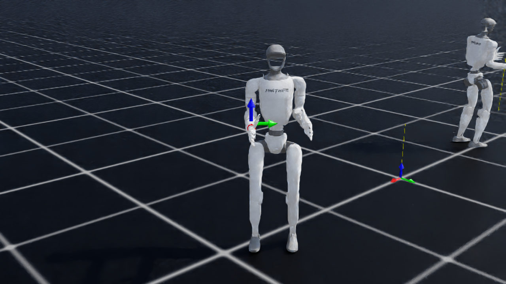
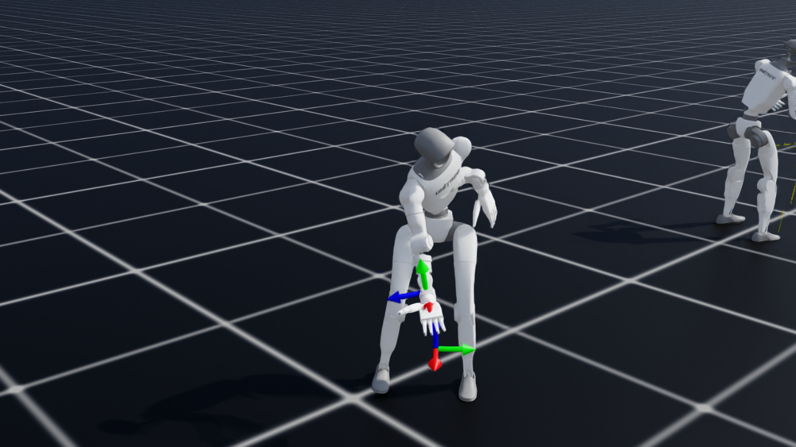
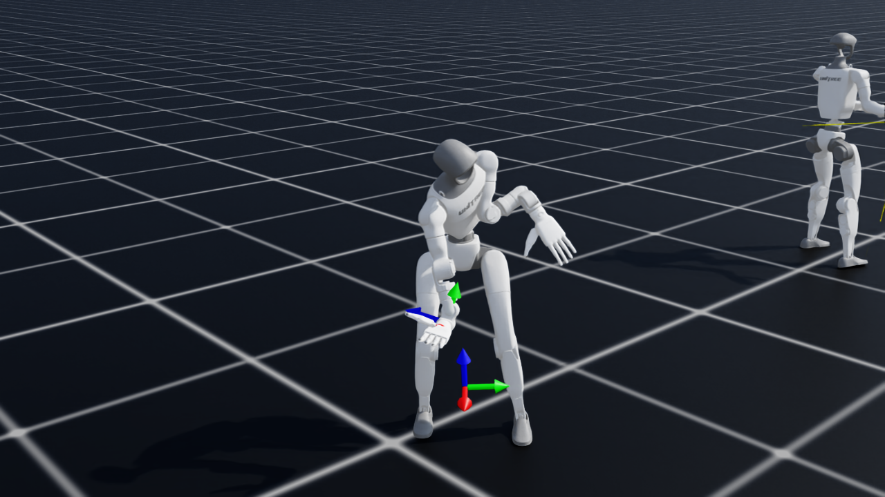

# Whole-Body Loco-Manipulation RL for Bed-Making — Unitree G1 on NVIDIA DGX Spark

> A physically-valid, sim-to-real-worthy reinforcement-learning policy that lets a **free-standing
> Unitree G1 humanoid (Inspire 5-finger hands) balance on its own two feet while bending deep over a
> bed to reach a commanded hand target** — the exact loco-manipulation skill that a walking policy
> cannot hold. Trained end-to-end in NVIDIA Isaac Lab on a **DGX Spark (GB10, aarch64)**.


*The trained G1 squats and leans forward to reach a low target, balancing on its own feet — no base
pinning, no teleporting, no joint freezing.*

**🎬 Final result video:** [`media/rl/bed_reach_policy.mp4`](media/rl/bed_reach_policy.mp4)
&nbsp;•&nbsp; **Deployable policy (committed):** [`rl/policy/policy.onnx`](rl/policy/policy.onnx) · [`rl/policy/policy.pt`](rl/policy/policy.pt) — exported from `model_799`

---

## 1. Why this matters (the problem)

Two G1s making a bed have to **lean out over the mattress and pull a sheet** — a deep forward-and-down
reach. A locomotion (walking) policy keeps the robot upright *while walking*, but the moment it bends
to reach over the bed the **center of mass travels past the support polygon and the robot topples**.
Earlier approaches confirmed this on hardware-faithful sim:

- A stationary **Pink-IK stand-and-reach** topples on the sustained lean.
- A **"toil mode"** drag-while-walking snags or launches the robot when the hand grips the cloth.
- The official **velocity-walk policy** balances beautifully while striding, but cannot hold the bend.

The fix is a **whole-body policy that owns balance *and* reach simultaneously**: the legs/ankles step
and counter-lean, the waist bends, the arm extends — all learned together so the deep reach never
becomes a fall. That is what this RL job produces.

> **Methodology rule we held throughout:** *verify by what the human sees* (rendered frames / mp4),
> never by reward telemetry alone. Every claim below is eye-verified in the video.

---

## 2. Result (eye-verified)

Across the full clip the policy tracks hand targets sampled from chest height down to near the floor,
**balancing on its own feet the entire time and recovering between targets — it never topples.**

| Balanced stance | Deep reach | Low reach | Forward reach |
|---|---|---|---|
|  |  |  |  |

**Convergence** (2048 envs, 800 PPO iterations, ~80 min on one GB10):


| PPO iteration | Hand→target error (cm) | Reach reward (≈max 1.0) | Mean total reward |
|---:|---:|---:|---:|
| 0   | 36.2 | 0.01 | −4.85 |
| 100 | 27.7 | 0.08 | −4.98 |
| 200 | 22.4 | 0.52 | −4.76 |
| 300 | 16.6 | 0.70 | −2.53 |
| 400 | 17.1 | 0.83 | −2.09 |
| 500 | 12.4 | 0.97 | −0.36 |
| 600 | 11.9 | 1.03 | −0.21 |
| 700 | 11.8 | 1.02 | −0.65 |
| 799 | **13.1** | **1.00** | **−0.45** |

The reach error falls **37 cm → ~12 cm** and the reach reward saturates near its maximum as the
balance-while-reach behaviour is acquired. Honest caveats: the hand lands *near* the target
(~12 cm average, not pinpoint), and this is a **free-space reach** — the target workspace mimics
bed-corner positions; the bed prop is added at deploy.

---

## 3. Approach

A **manager-based RL environment on Isaac Lab's native rails** (so it trains with the bundled
rsl-rl-lib), reformulating "track a base velocity" into **"reach a commanded hand target while
balancing on a free base."**

- **Robot:** Unitree G1, 29 body DOF + **Inspire 5-finger hands** (hard requirement — needed to grasp
  the sheet). **Free base, gravity on.** The legs balance through the normal actuator path; the waist
  and arm reach. **No kinematic cheats** (no base pinning / teleporting / joint freezing) so the policy
  is sim-to-real valid.
- **Command:** a 3-D hand-target pose sampled in the robot's **base frame** (`UniformPoseCommand`), so
  the policy is yaw-invariant. At deploy the behaviour layer feeds bed-corner positions as base-frame
  targets.
- **Reward:** a coarse + fine reach term (tanh kernels) drives the right `wrist_yaw_link` to the target;
  balance terms (anti-fall termination penalty, upright, pelvis height, no foot-slide) keep it standing;
  regularizers keep the motion smooth and hardware-able.
- **Algorithm:** PPO (rsl-rl-lib 5.x), the same proven recipe Isaac Lab uses for G1 locomotion.

The trained policy controls only the **29 body joints**; the Inspire fingers stay at their default and
are closed by a separate grip controller during grasping.

---

## 4. Platform & setup (DGX Spark, aarch64)

This is one of the load-bearing lessons: **getting Isaac Sim + Isaac Lab running well on the Spark.**

| Component | Detail |
|---|---|
| Machine | **NVIDIA DGX Spark** — GB10 (Grace-Blackwell), **aarch64**, sm_121, 128 GB unified memory, CUDA 13 |
| Isaac Sim | **5.1.0, built from source** (`/IsaacSim/_build/linux-aarch64/release`) — no prebuilt aarch64 binary/container exists, so a native source build is the working path |
| Isaac Lab | **2.3.2** (`./isaaclab.sh --install`), symlinked to the source Sim build |
| RL library | **rsl-rl-lib 5.0.1** (bundled with Isaac Lab 2.3.2) |
| PyTorch | cu13 build; GB10 is sm_121 (newer than torch's max advertised arch) → warns but runs |
| **aarch64 must-do** | `export LD_PRELOAD="$LD_PRELOAD:/lib/aarch64-linux-gnu/libgomp.so.1"` before every Isaac/Isaac-Lab run (per the Arm DGX-Spark Isaac learning path) |

**Tips that saved hours**

- **Build Isaac Sim natively from source on the Spark.** Prebuilt Isaac containers/binaries target x86_64;
  the source build is what actually runs on GB10/aarch64.
- Always `LD_PRELOAD` libgomp (above) or kit fails to load some plugins.
- Run training scripts **from the `IsaacLab` directory** — `./isaaclab.sh` is a relative launcher; `cd`-ing
  elsewhere first gives a silent `exit 127`.
- The GB10's **128 GB unified memory** comfortably runs 2048 parallel humanoids *and* a concurrent render
  instance (training used only ~4 GB).

---

## 5. Two blockers we solved (and the resources that helped)

### 5.1 The rsl_rl "version bug" — actually a missing shim call
Isaac Lab 2.3.2 ships rsl-rl-lib 5.x with a **new `actor`/`critic` config schema**; the old single-`policy`
schema is deprecated. Isaac Lab's own trainer converts it automatically via
`handle_deprecated_rsl_rl_cfg(...)`. The official Unitree trainer **skips that call**, so the runner does
`cfg["actor"].pop("class_name")` on a config that only has `policy` → **`KeyError: 'class_name'`**.
**Fix: call the shim (2 lines).** This is *not* a version-downgrade or Docker problem — Docker inherits the
same Isaac Lab and reproduces the error, and aarch64 has no working prebuilt Isaac container anyway. Our
env sidesteps it entirely by riding Isaac Lab's native rails (which already run the shim).
*Refs:* [unitree_rl_lab #115](https://github.com/unitreerobotics/unitree_rl_lab/issues/115) ·
`isaaclab_rl/rsl_rl/utils.py: handle_deprecated_rsl_rl_cfg`.

### 5.2 Free-base Inspire-hand G1 (NVIDIA's own open problem)
The stock `g1_29dof_inspire_hand.usd` ships **fixed-base + gravity-off** for tabletop manipulation and
bakes the `ArticulationRootAPI` onto a `/Robot/root_joint` world pin. Setting `fix_root_link=False`
only *disables* that joint, after which Isaac can no longer resolve the articulation root →
`Failed to create articulation`. NVIDIA's own forum thread on exactly this is **unanswered**, and their
floating loco-manip env dodges it by using the 3-finger Dex3 hand. **Fix:** a tiny local **override USD**
([`assets/g1_inspire_mobile.usd`](assets/g1_inspire_mobile.usd), 955 B, generated by
[`rl/make_inspire_mobile_usd.py`](rl/make_inspire_mobile_usd.py)) that references the stock USD,
**deactivates `root_joint`, and moves the `ArticulationRootAPI` onto `pelvis`** — yielding a true floating
base while keeping the Inspire hands. This reusably solves the forum's open issue.
*Refs:* [NVIDIA forum 370590 — Inspire mobile-base USD compatibility](https://forums.developer.nvidia.com/t/locomanipulation-with-inspire-5-finger-hand-mobile-base-usd-compatibility-issue/370590) ·
[IsaacLab PR #3440 (Inspire arm-damping stability)](https://github.com/isaac-sim/IsaacLab/pull/3440).

### 5.3 Headless eval video
`gymnasium.wrappers.RecordVideo` **does not capture Isaac Lab vector envs headless** (known bug). We
capture from an in-scene `Camera` sensor (`rgb`) per step and `ffmpeg`-encode — the same path the demo uses.
*Refs:* [IsaacLab #875](https://github.com/isaac-sim/IsaacLab/issues/875) ·
[IsaacLab discussion #2744](https://github.com/isaac-sim/IsaacLab/discussions/2744).

---

## 6. The exact training configuration (what made it work)

### Environment / simulation
| Parameter | Value | Why |
|---|---|---|
| Parallel envs | **2048** | GB10 throughput/memory sweet spot (used only ~4 GB) |
| PPO iterations | **800** | metric plateaus ~iter 500–600; 800 is comfortably converged |
| Control rate | **50 Hz** (`sim.dt = 0.005`, `decimation = 4`) | Isaac Lab locomotion convention; matches the deploy rate |
| Episode length | **8 s** | long enough to settle + track 2 resampled targets |
| Action | 29 body-joint position targets, `scale = 0.5`, default-offset | legs + 3-DOF waist + arms; Inspire fingers excluded |
| Observation | **103-D** | `base_lin_vel(3) + base_ang_vel(3) + proj_gravity(3) + hand_target(7) + joint_pos(29) + joint_vel(29) + last_action(29)` |
| Terrain | flat plane | bed prop deferred to deploy |

### PD gains (deploy-matched; the stock Inspire config collapses the policy)
| Joint group | Stiffness (kp) | Damping (kd) |
|---|---:|---:|
| Hips | 100 | 2 |
| Knees | 150 | 4 |
| Ankles | 40 | 2 |
| Waist (yaw/roll/pitch) | 200 | 5 |
| Arms (shoulder/elbow/wrist) | 40 | 10 |

> The stock `G1_INSPIRE_FTP_CFG` uses **waist kp 5000 / arms kp 3000** (tuned for stiff tabletop
> manipulation). Fed those gains a whole-body balance policy **collapses** — a documented gain-mismatch
> failure. We set the velocity-deploy gains on all 29 joints; the Inspire "hands" group is left as shipped.

### Reward terms
| Term | Weight | Role |
|---|---:|---|
| `reach_coarse` — `1 − tanh(d / 0.20)` | +2.0 | shapes the reach from far away |
| `reach_fine` — `1 − tanh(d / 0.06)` | +1.5 | sharpens accuracy near the target |
| `reach_l2` — `‖d‖` | −0.3 | mild distance penalty |
| `termination_penalty` (fall) | **−200** | the dominant signal: *do not fall* |
| `upright` (flat pelvis) | −1.0 | stay vertical through the lean |
| `base_height` (target 0.70 m) | −0.5 | discourage collapsing/over-squatting |
| `feet_slide` | −0.2 | plant the feet |
| `action_rate`, `dof_acc`, `dof_torques` | −0.01 / −2.5e-7 / −1e-5 | smooth, hardware-able motion |
| `dof_pos_limits` (ankle/knee) | −1.0 | stay inside joint limits |
| `joint_deviation` (hips / waist) | −0.15 / −0.05 | keep a natural posture; arms stay free to reach |

### Hand-target workspace (sampled in the base frame)
| Axis | Range (m) | Meaning |
|---|---|---|
| x (forward) | 0.15 → 0.50 | near → far forward reach |
| y (lateral) | −0.35 → 0.10 | mostly toward the right hand |
| z (vertical, rel. pelvis) | −0.45 → 0.05 | down to a deep bed-lean target |
| resample every | 3–5 s | learns to track arbitrary targets, not memorize one |

### Domain randomization (sim-to-real robustness)
Friction (static 0.7–1.1 / dynamic 0.5–0.9), reset pose (±0.2 m, full yaw) + velocity, joint scale
0.9–1.1, and **interval push perturbations** (±0.3 m/s every 4–7 s) so a nudged robot recovers rather
than topples.

### PPO hyperparameters (rsl-rl-lib 5.x)
| | |
|---|---|
| Actor / critic MLP | `[512, 256, 128]`, ELU |
| Learning rate | 1e-3, adaptive (target KL 0.01) |
| γ / λ | 0.99 / 0.95 |
| Clip / entropy / value-loss | 0.2 / 0.008 / 1.0 |
| Steps-per-env / epochs / minibatches | 24 / 5 / 4 |
| Max grad norm | 1.0 |

### How we picked the checkpoint cadence & key parameters
- **`save_interval = 100`** → a checkpoint every 100 iterations. With ~10 iters/min on the GB10 that is a
  model roughly every ~10 min, which let us **render intermediate checkpoints by eye while training ran**
  and confirm the reach-and-balance behaviour was emerging (not just reward going up).
- We took **`model_799`** (final) because the reach error and reward had **plateaued by ~iter 500–600**;
  iterations 600–800 are stable, so the last checkpoint is a safe, converged choice. (A best-by-metric
  checkpoint near iter 600 is equally valid.)
- **50 Hz control, deploy-matched PD gains, and the −200 fall penalty** were the three choices that most
  determined success: the rate/gains keep the dynamics deployable, and the heavy fall penalty makes the
  policy treat *not toppling* as non-negotiable while it learns to reach.

---

## 7. Reproduce it

```bash
# Always from the IsaacLab dir; LD_PRELOAD is mandatory on aarch64.
cd ~/workspaces/git/IsaacLab
export LD_PRELOAD="$LD_PRELOAD:/lib/aarch64-linux-gnu/libgomp.so.1"

# (one-time) build the mobile-base Inspire USD
./isaaclab.sh -p ~/workspaces/git/robots/examples/isaac_bed_making/rl/make_inspire_mobile_usd.py

# sanity-check the free-base articulation
./isaaclab.sh -p ~/workspaces/git/robots/examples/isaac_bed_making/rl/check_spawn.py

# train (~80 min on one GB10)
./isaaclab.sh -p ~/workspaces/git/robots/examples/isaac_bed_making/rl/train.py \
    --headless --num_envs 2048 --max_iterations 800

# render an eval mp4 (verify by eye)
./isaaclab.sh -p ~/workspaces/git/robots/examples/isaac_bed_making/rl/play.py \
    --headless --enable_cameras --video --num_envs 2 --video_length 350 \
    --checkpoint ~/workspaces/git/robots/examples/isaac_bed_making/rl/logs/bed_reach_g1/<run>/model_799.pt
# -> examples/isaac_bed_making/rl/eval/bed_reach_<tag>.mp4
```

Code (all under [`rl/`](rl/)): `robot_cfg.py` (mobile Inspire cfg + PD gains), `bed_reach_env_cfg.py`
(scene / command / reward / termination), `agents.py` (PPO cfg), `train.py`, `play.py`,
`check_spawn.py`, `make_inspire_mobile_usd.py`.

---

## 8. Resources & references

**Platform**
- [Arm Learning Path — Isaac Sim + Isaac Lab RL on DGX Spark](https://learn.arm.com/learning-paths/laptops-and-desktops/dgx_spark_isaac_robotics/)
- [NVIDIA Isaac Lab](https://github.com/isaac-sim/IsaacLab) · [Isaac Lab docs](https://isaac-sim.github.io/IsaacLab/) · [rsl_rl](https://github.com/leggedrobotics/rsl_rl)

**Robot & policies**
- [Unitree G1 description / URDF (`unitree_ros`)](https://github.com/unitreerobotics/unitree_ros)
- [Unitree `unitree_rl_lab` (official Isaac-Lab training)](https://github.com/unitreerobotics/unitree_rl_lab)
- G1 + Inspire-hand USD: `g1_29dof_inspire_hand.usd` (Isaac asset server) → our mobile override `assets/g1_inspire_mobile.usd`

**Issues / threads that unblocked us**
- [NVIDIA forum 370590 — Inspire 5-finger mobile-base USD compatibility](https://forums.developer.nvidia.com/t/locomanipulation-with-inspire-5-finger-hand-mobile-base-usd-compatibility-issue/370590) *(unanswered; solved here)*
- [unitree_rl_lab #115 — rsl_rl `KeyError: 'class_name'` on Isaac Sim 5.1](https://github.com/unitreerobotics/unitree_rl_lab/issues/115)
- [IsaacLab PR #3440 — G1 Inspire-hand teleop / arm-damping fixes](https://github.com/isaac-sim/IsaacLab/pull/3440)
- [IsaacLab #875](https://github.com/isaac-sim/IsaacLab/issues/875) & [discussion #2744](https://github.com/isaac-sim/IsaacLab/discussions/2744) — headless `RecordVideo` is broken for vec envs

**Artifacts in this repo**
- Final video: [`media/rl/bed_reach_policy.mp4`](media/rl/bed_reach_policy.mp4)
- Convergence plot: [`media/rl/convergence.png`](media/rl/convergence.png)
- Deployable policy (committed): [`rl/policy/`](rl/policy/) — `policy.onnx`, `policy.pt` (full training logs/checkpoints regenerate under `rl/logs/`)

---

## 9. What's next
1. **Tighten reach accuracy** toward < 5 cm (sharper fine reward / easy→deep workspace curriculum / longer
   training / success bonus).
2. **Deploy into the demo** — wire the exported `policy.onnx` into the two-G1 behaviour layer, replacing the
   topple-prone stand-and-reach, and verify the full bed-making demo by eye.

---

*Hardware: NVIDIA DGX Spark (GB10). Stack: Isaac Sim 5.1 (source build, aarch64) · Isaac Lab 2.3.2 ·
rsl-rl-lib 5.0.1 · PyTorch cu13. Physically valid for sim-to-real — no kinematic cheats.*
