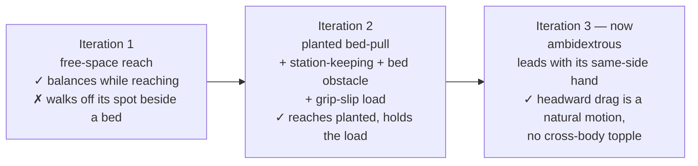
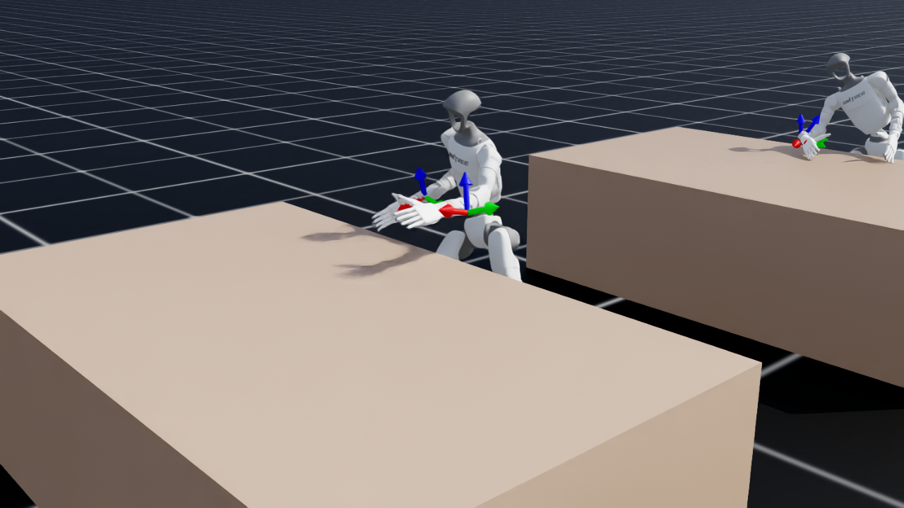
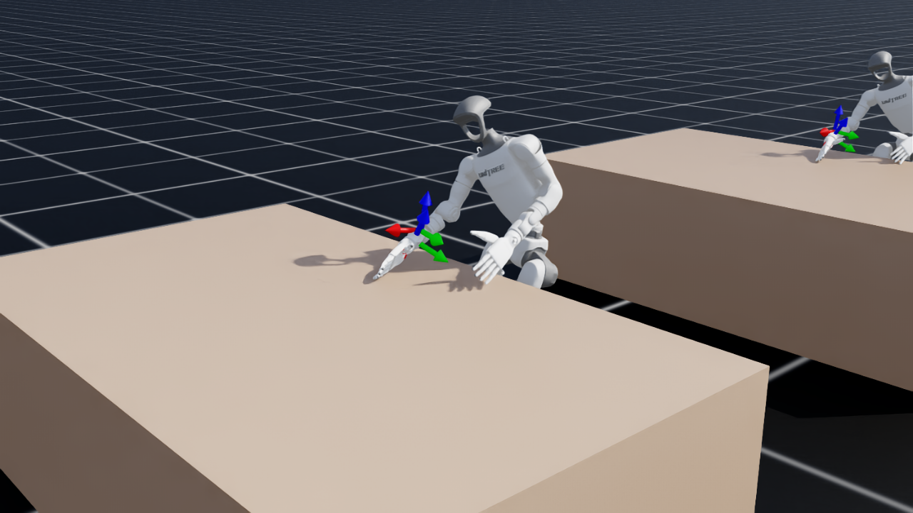
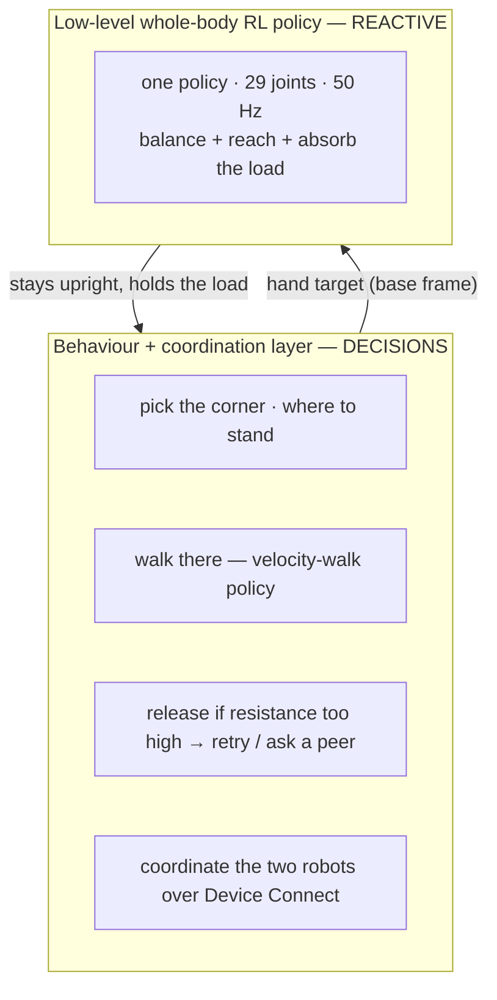

# Whole-Body Loco-Manipulation RL for Bed-Making — Unitree G1 on NVIDIA DGX Spark

> Teaching two **free-standing Unitree G1 humanoids (Inspire 5-finger hands)** to **balance on their
> own two feet while bending over a bed and pulling a sheet** — the loco-manipulation skill a walking
> policy cannot hold. Trained end-to-end in **NVIDIA Isaac Lab** on a **DGX Spark (GB10, aarch64)**.
>
> *Loco-manipulation = moving and manipulating at the same time. The hard part isn't the reach or the
> balance alone — it's holding both **together** when the reach pulls the robot off balance.*
>
> Just as important as the robot: **how it was built.** It applies the field's best robot-learning
> research where it exists — and does real engineering on the genuinely open problems where it doesn't
> (a free-base Inspire-hand G1, an out-of-env *ambidextrous* deployment, a real-to-sim sensing method).
> See [§1](#1-how-it-was-built).


*The current policy: a free-base G1 leans over the bedside — feet planted outside the bed, knees
against it — to reach a target on the mattress, balancing entirely on its own (no base pinning, no
teleporting, no joint freezing). "Free base" = the robot is **not** bolted to the world; it has to keep
itself upright, exactly like the real hardware.*

**🎬 Policy video (current iteration — ambidextrous):** [`media/rl/ambidextrous_eval.mp4`](media/rl/ambidextrous_eval.mp4)
&nbsp;•&nbsp; **Deployable policy (committed):** [`rl/policy/policy.onnx`](rl/policy/policy.onnx) · [`rl/policy/policy.pt`](rl/policy/policy.pt)

> **Status — read this first.** The policy is now **ambidextrous** (iteration 3): each robot reaches with
> the hand on the target's side, so the headward sheet-drag is a natural same-side motion, not the
> cross-body sweep that toppled a robot before. **Verified in isolation** (eye-checked: both-handed,
> balanced, no topple). In the **full two-G1 demo** the robots now **walk in arms-at-their-sides and the
> full-overhang sheet drapes during the walk**; the last gap is the **walk→reach handoff**, being closed by
> a warm-start retrain ([§8](#8-status--whats-next)). **This is a living document.**

---

## 1. How it was built

The fastest path through a hard robotics problem is to **stand on the field's best work** — most of
applied physical AI is *integration under real-world constraints*, not new theory. So the spine of this
system is reused, deliberately: the balance-while-reach formulation rides **Isaac Lab's locomotion RL
rails** and the **PPO** recipe; the grip-slip robustness is **FALCON**-style force-adaptive whole-body
control; the *learn-to-reach-then-add-force* curriculum is **NVIDIA's Isaac Lab 2.3** pattern; the
ambidexterity is **morphological symmetry** (SYMDEX). *(PPO = the standard RL training algorithm.)*

But "apply, don't reinvent" is the default, not a limit — and three pieces here had no shelf solution,
so we built them:
- **An open NVIDIA problem, solved.** The 5-finger Inspire-hand G1 can't be given a free (mobile) base by
  the documented switch, and NVIDIA's own forum thread on exactly this is **unanswered**. We found a
  reusable fix (a tiny override USD; [§7](#7-the-research--resources-we-reused)).
- **An Isaac Lab policy deployed *outside* its training env** — reverse-engineering the exact 151-D
  observation + action map so it runs in the two-robot demo, and making it **ambidextrous with no
  observation change** (the same-side trick) so two flanking robots both pull naturally.
- **A real-to-sim method.** Isaac Sim doesn't expose a real robot's sensor/effector envelope, so
  on-hardware sensor characterization (**robotics-connect**) calibrates the sim *and* cuts RL training
  cycles ([§6](#6-closing-the-real-to-sim-gap-with-robotics-connect)) — real-to-sim feeding sim-to-real.

That is the honest shape of applied physical AI: assemble the proven pieces, and do real engineering on
the few that nobody has solved yet.

### The real insight: the human/AI division of labour

Working with a partner AI (Claude Code) made one split natural — and it is the split that *scales*
applied physical AI:

| The **human engineer** owns the *abstract* problem-solving | The **partner AI** owns the *implementation* problem-solving |
|---|---|
| What to build; which research applies; the physics/architecture calls (*"keep the feet planted — that's the bug,"* *"a sustained pull-load is the next gap"*) | Writing the env, reverse-engineering the observation, wiring it up, debugging launches and topples, running and babysitting training |
| Judgement: **verify by what the human sees** (rendered video), reject over-claims, decide the next iteration | The candidate fixes, the probe scripts, the convergence plots, this document |

A rough sense of the split for *this* iteration — and the point is the asymmetry:

- **Human decisions fit in a few sentences:** keep it physically valid (no kinematic cheats); use the
  Inspire hands; start the robot *hands-at-its-sides*; the bug is that it won't stay *planted*; train it
  to lean-and-pull without losing balance; here's the research that applies; verify by eye; and push
  *walking / giving-up / avoiding others* down to the behaviour layer.
- **The AI did essentially everything else:** the RL environment and its custom reward + force terms,
  the bed-obstacle scene, the out-of-env deployment, the launch/topple debugging, the training/eval/probe
  runs, the convergence analysis, and this writeup.

The scarce resource in physical AI is **human reasoning about the physical world.** Pushing the
*computational and implementation* burden onto the AI spends that reasoning only where a human is truly
required — which research to apply, what "working" looks like, and where the real gap is — and lets one
engineer move at the pace of a team.

---

## 2. The problem (why it's hard)

Two G1s making a bed must **lean out over the mattress and pull a sheet** — a deep forward-and-down
reach. A locomotion (walking) policy keeps the robot upright *while walking*, but the instant it bends to
reach over the bed, the **centre of mass (CoM) travels past the feet and the robot topples.** We
confirmed this every other way first:

- A stationary **inverse-kinematics stand-and-reach** topples on the sustained lean.
- A **drag-while-walking** strategy snags or launches the robot when the hand grips the cloth.
- The official **velocity-walk policy** balances beautifully while striding but cannot hold the bend.

The fix is a **single whole-body policy** — one controller for the legs, waist *and* arms — that owns
balance *and* reach at once, so the reach never becomes a fall.

> **Methodology rule held throughout:** *verify by what the human sees* (rendered video), never by reward
> telemetry alone. Every claim below is eye-verified.

---

## 3. The policy, in three iterations



### 3.1 Iteration 1 — whole-body *free-space* reach (the intermediate step)

The first policy learned to **balance on a free base while reaching a hand target** sampled in a
forward-and-down cone (no bed in the scene). It worked: the G1 squats and leans to targets from chest
height to near the floor and **never topples** — reach error converged **37 cm → ~12 cm**.

 &nbsp; *(full clip: [`media/rl/bed_reach_policy.mp4`](media/rl/bed_reach_policy.mp4))*

**Why it was only a stepping stone.** It proved balance-while-reach is learnable — but it had **no
incentive to keep its feet planted.** In free space it was free to *step* toward a target to stay
balanced. Beside a real bed (feet outside, reaching *over* the mattress) it does exactly that: reaching
forward shifts the CoM forward, so it **steps backward** to recover, the fixed sheet target then sits
even farther forward in its receded frame, it leans harder — and it **walks itself off its spot and
topples.** The missing ingredient was *staying planted*.

### 3.2 Iteration 2 — *planted bed-pull* (current policy)

The current policy keeps the same balance-while-reach core and adds exactly what was missing for a
**bedside** reach — each piece an application of reused research:

| Added this iteration | What it does | Reused from |
|---|---|---|
| **Station-keeping** reward | Penalises the base drifting off its spawn spot → it reaches by *leaning/squatting with planted feet*, not by stepping away. The fix for the walk-off. (*Station-keeping = stay on your spot.*) | standard locomotion reward shaping |
| **Bed as a collision obstacle** | The robot must bend *over* the bedside (feet outside, knees against it) — the real constraint a free-space policy never feels. | the deployment scene, brought into training |
| **Grip-slip / sheet-tension load** | A random horizontal force on the hand that **toggles on and off** → the policy learns to absorb a *sudden* load change without toppling ("don't fall when the sheet slips or you let go"). | **FALCON** force-adaptive WBC; unified position/force loco-manip; Isaac Lab 2.3 force-disturbance curriculum |
| **Wider reach + drag workspace** | Targets span forward **and both lateral sides** → the planted policy can reach *and drag headward* in any needed direction. | — |
| **Natural idle-arm** regularizer | Keeps the non-reaching arm from contorting into an uncanny counter-balance (small counter-motions still allowed). | standard posture regularization |

### 3.3 Iteration 3 — *ambidextrous* (current policy)

Wired into the two-G1 demo, iteration 2 exposed one more gap. The robots flank **opposite** sides of the
bed, so when both pull the sheet *headward* with the **same** (right) hand, one does a natural outward
sweep while its mirror does an awkward **cross-body** sweep — and the cross-body robot topples.

The fix is **ambidexterity**, applied straight from the robot's **bilateral symmetry** (*SYMDEX*,
[arXiv 2505.05287](https://arxiv.org/abs/2505.05287)): the policy reaches with **whichever hand is on the
target's side**. Implemented as *same-side* reward, idle-arm and force terms that read the active hand from
the command's lateral sign — so it needs **no change to the 151-D observation**; the deployed policy stays
a drop-in. Now each robot leads with its natural same-side hand and the headward drag is a clean abduction
for both. **Eye-verified in isolation: it reaches targets on both sides, balanced and leaning over the
bed, no topple.**

| Reach over the bedside | Lateral reach (the drag) |
|---|---|
|  |  |

🎬 **[`media/rl/ambidextrous_eval.mp4`](media/rl/ambidextrous_eval.mp4)** — both-handed, balanced, no topple.

In the **full demo** the robots now **spawn ~1 m out and walk to the bedside with their arms at their
sides** (the canonical Unitree stance — see [§6](#6-closing-the-real-to-sim-gap-with-robotics-connect)),
and the **full 9-inch-overhang sheet drapes during the walk** so its overhang folds down off the bed edges
instead of dumping on their arms — both stand through settle, reach and grip. The last gap is the
**walk→reach handoff** (the reach policy's neutral must match the at-sides walk pose), being closed by a
**warm-start retrain** that re-centres the reach policy on that same neutral ([§8](#8-status--whats-next)).

---

## 4. Result (eye-verified, current policy)

In isolation the policy reaches targets on and above the bed surface (forward **and** lateral — the
headward drag direction), **balancing on its own feet and staying planted at the bedside the entire
time.**

| Lean over the bedside | Lateral reach (drag direction) |
|---|---|
|  |  |

🎬 **[`media/rl/bed_pull_policy.mp4`](media/rl/bed_pull_policy.mp4)** — 350 frames, no topple.

**Convergence** (2048 parallel robots, 1000 PPO iterations, ~30 min on one GB10): hand→target error
**~37 cm → ~6 cm**; base drift stays small and stable (**planted**); falls are rare even with the
grip-slip load toggling. *(The iteration-1 curve below is for reference — same rig, before the bedside
additions.)*


> **Honest caveats — and why they're here.** ~6 cm is *near*, not pinpoint. And this is the **policy in
> isolation.** In the full two-G1 demo the robots walk in arms-at-their-sides, the full-overhang sheet
> drapes during the walk, and both reach and grip the real particle-cloth sheet while staying planted; the
> remaining gaps are the **walk→reach handoff** (a warm-start retrain in flight) and the **sustained**
> pull-load ([§8](#8-status--whats-next)). We surface this on purpose: engineers should trust a result
> more, not less, when its limits are stated plainly.

---

## 5. Architecture — who owns what

A clean two-layer split (the consensus across the loco-manipulation literature) keeps the RL job
tractable: the **low-level policy stays reactive**; **all decisions live above it.**



So *walking to different positions*, *deciding to let-go / retry / ask a peer for help*, and *avoiding
another robot* are **behaviour-layer** jobs — not terms in the RL reward. Trying to train those into the
balance policy would make it intractable and brittle.

---

## 6. Closing the real-to-sim gap with robotics-connect

Training in simulation only transfers to hardware if the **simulated robot matches the real one** — and a
simulator, however good, **does not fully expose a real robot's sensor and effector envelope.** Isaac Sim
hands you idealized cameras and ray-casts; the *actual* G1's sensors are tilted, range-limited, and
**occluded by the robot's own body** in ways the sim will never tell you. Bridging that is **real-to-sim**:
measure the hardware, then build the sim to match — the loop that *feeds* sim-to-real.

We close it with **[robotics-connect](https://github.com/armwaheed/robotics-connect)** — Arm's Unitree G1
EDU control stack, where each sensor and effector is **characterized on the physical robot.** That
on-hardware characterization is **calibration data an AI agent can build the simulator from**, and it pays
off twice.

**1. It calibrates the simulated sensors to the real ones.** Two measurements that a sim would otherwise
make you guess:

- **RGB camera angle + viewing distance.** `depth_camera_sight` calibrates the head Intel RealSense's
  downward tilt **on the dev robot to 51.29°** (a floor-plane fit), and documents the hard constraint that
  at that pitch it sees the floor and the near bed but **not** the broader room — while a mattress edge is
  still resolvable **2–3 m out** in the upper frame. Our simulated head camera is set to **exactly 51.29°**
  *because of that measurement*, not a guess.
- **LiDAR near-field fidelity + self-occlusion.** `lidar_sight` characterizes the crown **Livox MID-360**:
  a table surface reads cleanly at **0.4 m forward / −0.05 m down (≈ −7° elevation)** — near-field
  detection works, a 0.66 m bed is seen up close — while the robot's **own face-frame blanks ±40–45° of
  azimuth** and its **chin blanks everything below −10° elevation**. Our simulated LiDAR (an Isaac
  `RayCaster`) reproduces **those exact blind spots**, so a bed-detector that works in sim works on the
  robot. *(Full-fidelity RTX-Livox replay is neither affordable nor the point — the real device is already
  characterized on hardware; the sim only needs to share its blind spots.)*

Without this an agent guesses the camera angle and assumes an unobstructed LiDAR — and sim-trained
perception silently fails on the real robot. The measurement comes from the **hardware**; the **sim is
built to match it** (the bed perception lives in [`perception.py`](perception.py)).

**2. It cuts RL training cycles by getting the rewards and constraints right up front.** Knowing what the
*real* hardware and task demand lets the agent encode the correct rewards and constraints on the first
pass, instead of discovering them by burning training runs:

- the **at-sides arm neutral** is taken straight from the **real Unitree walking policy's own default
  pose** — so the trained reach policy's neutral matches the deploy stance and the walk→reach handoff lands
  in-distribution (no training cycles wasted on a mismatched pose);
- the **grip-slip / sheet-tension force** model and the **bed-as-obstacle** constraint reflect what the
  real bedside reach actually involves;
- the **sensor placement** (head-cam down-tilt, crown LiDAR) is fixed before training, not retrofitted.

Each is a constraint the agent would otherwise have to *find* the hard way. robotics-connect turns
"characterize it on the robot once" into **fewer, better-aimed training runs** — real-to-sim feeding
sim-to-real.

---

## 7. The research & resources we reused

The spine of this system is reused — found and applied. (The genuinely open problems we *did* have to
build are in [§1](#1-how-it-was-built).)

**Research papers (the force-adaptive / whole-body-control ideas we applied)**
- **FALCON: Learning Force-Adaptive Humanoid Loco-Manipulation** — adapting a whole-body policy to
  hand-force loads. *This is the basis for the grip-slip / sheet-tension training.*
  [arXiv 2505.06776](https://arxiv.org/abs/2505.06776)
- **Learning a Unified Policy for Position and Force Control in Legged Loco-Manipulation** —
  [arXiv 2505.20829](https://arxiv.org/abs/2505.20829)
- **AdaptManip: Adaptive Whole-Body Object Lifting with Online State Estimation** —
  [arXiv 2602.14363](https://arxiv.org/abs/2602.14363)
- **NVIDIA Isaac Lab 2.3 — Whole-Body Control & teleoperation** (the *learn-to-reach-then-add-force*
  curriculum, and the low-level-WBC / high-level-task split we followed):
  [NVIDIA blog](https://developer.nvidia.com/blog/streamline-robot-learning-with-whole-body-control-and-enhanced-teleoperation-in-nvidia-isaac-lab-2-3/)
- **NVIDIA Isaac GR00T N1.6 sim-to-real** (WBC as the low-level loco-manipulation layer):
  [NVIDIA blog](https://developer.nvidia.com/blog/building-generalist-humanoid-capabilities-with-nvidia-isaac-gr00t-n1-6-using-a-sim-to-real-workflow/)

**NVIDIA forum threads / GitHub issues that directly unblocked us**
- **Free-base Inspire-hand G1** — the stock `g1_29dof_inspire_hand.usd` ships fixed-base + gravity-off and
  bakes the articulation root onto a `/Robot/root_joint` world pin; `fix_root_link=False` only *disables*
  that joint and then `Failed to create articulation`. **NVIDIA's own forum thread on exactly this is
  unanswered**, and their floating loco-manip env sidesteps it with the 3-finger Dex3 hand. *Fix
  (reusable): a 955-byte override USD* ([`assets/g1_inspire_mobile.usd`](assets/g1_inspire_mobile.usd),
  built by [`rl/make_inspire_mobile_usd.py`](rl/make_inspire_mobile_usd.py)) that deactivates `root_joint`
  and moves `ArticulationRootAPI` onto `pelvis` → a true free base *with* the Inspire hands.
  → [NVIDIA forum 370590](https://forums.developer.nvidia.com/t/locomanipulation-with-inspire-5-finger-hand-mobile-base-usd-compatibility-issue/370590) *(unanswered; solved here)* ·
  [IsaacLab PR #3440 (Inspire arm-damping stability)](https://github.com/isaac-sim/IsaacLab/pull/3440)
- **rsl_rl `KeyError: 'class_name'`** — Isaac Lab 2.3.2 ships rsl-rl-lib 5.x with a new `actor`/`critic`
  config schema; the official Unitree trainer skips Isaac Lab's deprecation shim. *Fix: call
  `handle_deprecated_rsl_rl_cfg(...)` (2 lines). Not a version/Docker problem.*
  → [unitree_rl_lab #115](https://github.com/unitreerobotics/unitree_rl_lab/issues/115)
- **Applying external forces in a manager-based env** (how the grip-slip load is injected) →
  [IsaacLab discussion #1360](https://github.com/isaac-sim/IsaacLab/discussions/1360) ·
  [Isaac Lab events module](https://isaac-sim.github.io/IsaacLab/main/source/api/lab/isaaclab.envs.mdp.html)
- **Headless eval video** — `gymnasium.RecordVideo` doesn't capture Isaac Lab vec envs headless; we read
  an in-scene `Camera` sensor and `ffmpeg`-encode. →
  [IsaacLab #875](https://github.com/isaac-sim/IsaacLab/issues/875) ·
  [discussion #2744](https://github.com/isaac-sim/IsaacLab/discussions/2744)

**Platform & official code**
- [Arm Learning Path — Isaac Sim + Isaac Lab RL on DGX Spark](https://learn.arm.com/learning-paths/laptops-and-desktops/dgx_spark_isaac_robotics/)
- [NVIDIA Isaac Lab](https://github.com/isaac-sim/IsaacLab) · [Isaac Lab docs](https://isaac-sim.github.io/IsaacLab/) · [rsl_rl](https://github.com/leggedrobotics/rsl_rl)
- [Unitree `unitree_rl_lab`](https://github.com/unitreerobotics/unitree_rl_lab) · [`unitree_ros` (G1 URDF)](https://github.com/unitreerobotics/unitree_ros)

---

## 8. Status & what's next

**Done:** balance-while-reach (it.1) → planted bedside reach + grip-slip robustness (it.2) →
**ambidextrous same-side reach** (it.3, eye-verified in isolation: both-handed, balanced, no topple). In
the full demo the robots **walk in arms-at-their-sides and the full 9-inch-overhang sheet drapes during
the walk** without toppling them; both stand through settle, reach and grip. Policy committed at
[`rl/policy/`](rl/policy/).

**In progress:**
1. **Walk→reach handoff** — the walk hands off the at-sides pose; the reach policy's neutral must match it.
   Being closed by a **warm-start retrain** that re-centres the reach policy on the same at-sides neutral,
   so one pose serves both the walk and the reach — a seamless handoff.
2. **Sustained pull-load** — the real sheet is a *sustained, motion-opposing* load, harder than the
   training's *random* toggling force. Next: a **behaviour-layer "release if resistance is too high →
   retry / ask a peer"** (the decision belongs above the balance policy), and/or retrain the load to
   oppose the drag direction.
3. **Wire the perception layer** — the robotics-connect-calibrated LiDAR/RGB
   ([§6](#6-closing-the-real-to-sim-gap-with-robotics-connect)) into the demo's *detect → approach →
   switch* behaviour layer.

**This is a living document** — updated as the policy evolves toward a fully working bed-making system.

---

## Appendix A — Platform & setup (DGX Spark, aarch64)

Getting Isaac Sim + Isaac Lab running well on the Spark is itself load-bearing.

| Component | Detail |
|---|---|
| Machine | **NVIDIA DGX Spark** — GB10 (Grace-Blackwell), **aarch64**, sm_121, 128 GB unified memory, CUDA 13 |
| Isaac Sim | **5.1.0, built from source** — no prebuilt aarch64 binary/container exists, so a native source build is the working path |
| Isaac Lab | **2.3.2** (`./isaaclab.sh --install`), symlinked to the source Sim build |
| RL library | **rsl-rl-lib 5.0.1** (bundled with Isaac Lab 2.3.2) |
| PyTorch | cu13 build; GB10 is sm_121 (newer than torch's max advertised arch) → warns but runs |
| **aarch64 must-do** | `export LD_PRELOAD="$LD_PRELOAD:/lib/aarch64-linux-gnu/libgomp.so.1"` before every Isaac run |

**Tips that saved hours:** build Isaac Sim **natively from source** (prebuilt containers target x86_64);
always `LD_PRELOAD` libgomp; run scripts **from the `IsaacLab` directory** (`./isaaclab.sh` is a relative
launcher — `cd`-ing away first gives a silent `exit 127`); the 128 GB unified memory runs 2048 parallel
humanoids on only ~4 GB.

---

## Appendix B — The exact training configuration

A **manager-based RL environment on Isaac Lab's native rails**. Free-base G1, 29 body DOF + Inspire
5-finger hands, gravity on, **no kinematic cheats.**

### Environment / simulation
| Parameter | Value |
|---|---|
| Parallel envs | **2048** |
| PPO iterations | **1000** (reach error plateaus well before; ~30 min on one GB10) |
| Control rate | **50 Hz** (`sim.dt = 0.005`, `decimation = 4`) |
| Episode length | **8 s** |
| Action | 29 body-joint position targets (`scale 0.5`, default-offset); Inspire fingers excluded |
| Observation | **151-D**: `base_lin_vel(3) + base_ang_vel(3) + proj_gravity(3) + hand_target(7) + joint_pos(53) + joint_vel(53) + last_action(29)` |
| Scene | flat plane **+ a bed collision box in front** (robot faces it; ±15° yaw) |

### Reward terms (current)
| Term | Weight | Role |
|---|---:|---|
| `reach_coarse` / `reach_fine` (tanh, std 0.20 / 0.06) | +2.0 / +1.5 | shape then sharpen the hand→target reach |
| `reach_l2` | −0.3 | mild distance penalty |
| **`base_anchor` (xy drift from spawn)** | **−2.0** | **station-keeping — reach by leaning, stay planted** |
| `termination_penalty` (fall) | **−200** | the dominant signal: *do not fall* |
| `upright` / `base_height` (0.70 m) / `feet_slide` | −1.0 / −0.5 / −0.2 | stay vertical, don't collapse, plant the feet |
| **`joint_deviation_left_arm`** | **−0.2** | **keep the idle arm natural (no uncanny pose)** |
| `joint_deviation` hips / waist | −0.15 / −0.05 | natural lower-body posture |
| `action_rate` / `dof_acc` / `dof_torques` / `dof_pos_limits` | small | smooth, hardware-able motion |

### Hand-target workspace (base frame) · domain randomization
*Domain randomization = deliberately varying sim parameters during training so the policy is robust on
real hardware, not tuned to one perfect sim.*

| Axis | Range (m) | | DR term | Value |
|---|---|---|---|---|
| x forward | 0.18 → 0.55 | | friction (static/dyn) | 0.7–1.1 / 0.5–0.9 |
| y lateral | −0.40 → 0.40 (**both sides — the drag**) | | reset yaw / vel | ±15° / small |
| z (rel. pelvis) | −0.16 → 0.10 (on/above the surface) | | base push | ±0.3 m/s every 4–7 s |
| resample | every 3–5 s | | **grip-slip force** | **0–35 N on the hand, toggling on/off every 1–2.5 s** |

### PD gains (deploy-matched — the stock Inspire config collapses the policy)
Hips kp 100 / Knees 150 / Ankles 40 / Waist 200 / Arms 40 (kd 2 / 4 / 2 / 5 / 10). The stock
`G1_INSPIRE_FTP_CFG` uses waist kp 5000 / arms kp 3000 (stiff tabletop manipulation); fed those, a
whole-body balance policy **collapses** — a documented gain-mismatch failure.

### PPO (rsl-rl-lib 5.x)
Actor/critic MLP `[512, 256, 128]` ELU · LR 1e-3 adaptive (target KL 0.01) · γ/λ 0.99/0.95 · clip/entropy
0.2/0.008 · 24 steps-per-env, 5 epochs, 4 minibatches.

---

## Appendix C — Reproduce it

```bash
# Always from the IsaacLab dir; LD_PRELOAD is mandatory on aarch64.
cd ~/workspaces/git/IsaacLab
export LD_PRELOAD="$LD_PRELOAD:/lib/aarch64-linux-gnu/libgomp.so.1"

# (one-time) build the mobile-base Inspire USD
./isaaclab.sh -p ~/workspaces/git/robots/examples/isaac_bed_making/rl/make_inspire_mobile_usd.py

# train (~30 min on one GB10)
./isaaclab.sh -p ~/workspaces/git/robots/examples/isaac_bed_making/rl/train.py \
    --headless --num_envs 2048 --max_iterations 1000

# render an eval mp4 (verify by eye)
./isaaclab.sh -p ~/workspaces/git/robots/examples/isaac_bed_making/rl/play.py \
    --headless --enable_cameras --video --num_envs 4 --video_length 350 \
    --checkpoint ~/workspaces/git/robots/examples/isaac_bed_making/rl/logs/bed_reach_g1/<run>/model_999.pt
```

Code (all under [`rl/`](rl/)): `robot_cfg.py` (mobile Inspire cfg + PD gains), `bed_reach_env_cfg.py`
(scene / bed / command / reward / termination), `mdp.py` (station-keeping reward + grip-slip force),
`agents.py` (PPO cfg), `train.py`, `play.py`, `make_inspire_mobile_usd.py`.

---

*Hardware: NVIDIA DGX Spark (GB10). Stack: Isaac Sim 5.1 (source build, aarch64) · Isaac Lab 2.3.2 ·
rsl-rl-lib 5.0.1 · PyTorch cu13. Physically valid for sim-to-real — no kinematic cheats. Apply the
proven research, build the open pieces, verify by eye, iterate.*
