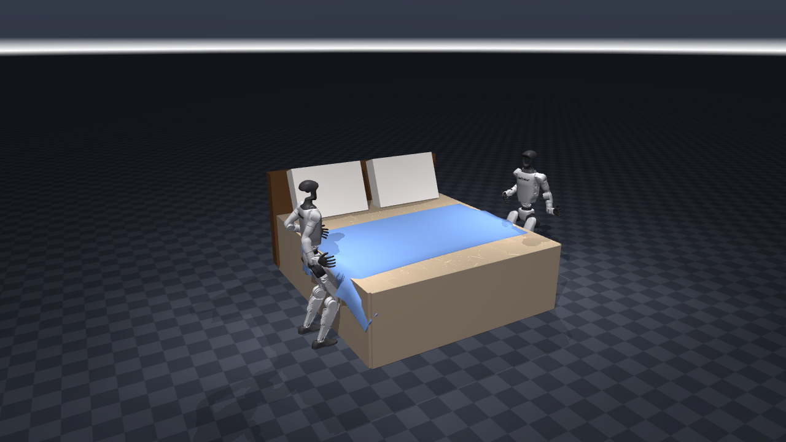

# Two G1s make a bed — pure mjlab / MuJoCo-Warp (no NVIDIA / Isaac / Newton)

Two Unitree G1 humanoids flank a correctly-proportioned wide low bed and **make it together**,
coordinating over the **Model Hardware Standard (MHS)** — rendered entirely on
**[mjlab](https://github.com/mujocolab/mjlab) / MuJoCo-Warp**. No Isaac Sim, no Isaac Lab, no Newton,
nothing NVIDIA-proprietary. Both robots are driven by the trained whole-body bed-reach policy
(`policy/bed_reach_g1.onnx`); the second robot runs the same single-hand policy through a sagittal
mirror, so one policy drives a bimanual pair.



The result — `media/bed_making.mp4` — reads as *two humanoids making a bed*: a **2.0 × 1.8 × 0.61 m**
mattress (wide, low, long), a headboard, two propped pillows, and a **real deformable bedsheet** — a
native MuJoCo `flexcomp` cloth that drapes off the sides, folds over the foot, wrinkles under the
hands, and is drawn headward toward the pillows one hand-over-hand stroke at a time.

## The demo (this is the `examples/mjlab_bed_making/demo/` deliverable)

```bash
# from the repo root, with the mjlab venv on PATH (see "Install" below)
python examples/mjlab_bed_making/demo/two_robot_bed.py            # renders media/bed_making.mp4
python examples/mjlab_bed_making/demo/two_robot_bed.py --probe    # fast, no render: logs the reach envelope
python examples/mjlab_bed_making/demo/two_robot_bed.py --coord broker --nats-url nats://127.0.0.1:4222
```

| file | what it is |
| --- | --- |
| `demo/bed_scene.py` | Builds ONE MuJoCo model with **two** mjlab-configured G1s (attached with `MjSpec.attach`, each keeping its own floating base, actuators, IMU sensors) + the bed. **Bed geometry is copied verbatim from `examples/isaac_bed_making/scene.py`** — the authoritative target. Also holds the sagittal-mirror tables. |
| `demo/g1_policy.py` | Rebuilds the exact 103-dim observation mjlab feeds the policy, out of raw MuJoCo state, and runs the ONNX per robot. The +y robot is driven through the sagittal mirror. |
| `demo/cloth_sheet.py` | Authors the sheet: a 2-D `flexcomp` cloth (504 vertices, 918 triangles) emitted as `type="direct"` so its stress-free rest shape is the unmade shape it starts in. Also owns the collision bits. |
| `demo/two_robot_bed.py` | The rollout + render: scripts the pelvis-frame reach, opens and closes the grip on the cloth, wires the MHS coordination, and writes the MP4 + trace. |

### What is the trained policy, and what is an abstraction

The issue asks for honesty here, so:

* **Trained (the hard, valuable part).** Both robots' **balanced whole-body reach onto the bed**, the
  **hold under load**, and the **~0.1 m headward hand draw** — done while staying planted at the
  bedside (the base never drifts or falls across the 36 s clip, under a real cloth load). This is the loco-manipulation-under-load
  skill the earlier Isaac reach policy never had; it comes straight from the FALCON station-keeping +
  force-curriculum training in this package (see `DESIGN.md`). The `--probe` mode logs the measured
  reach envelope for both robots — they are exact mirror images, which validates both the observation
  reconstruction and the mirror.
* **Simulated, not scripted.** The **sheet**. It is a deformable `flexcomp` cloth with continuum
  membrane + bending elasticity, contacting the mattress, the bed sides, the pillows and the robots'
  hands. It drapes, folds, wrinkles, gathers and slides because the solver says so. **Nothing moves the
  sheet kinematically** — the previous cut of this demo translated a rigid mocap "cover" along a
  scripted stroke, and that grip-lock abstraction is now gone.
* **Abstraction (documented).** The **grip**. The mjlab G1 has no fingers — each hand is a single rigid
  capsule — so there is nothing to pinch with. While a grip is closed, the handful of cloth under the
  palm (8 vertices within 0.3 m) is held to the hand by MuJoCo `connect` equalities, switched on at the
  grip and off at the release. Everything after that — how much sheet actually moves, how it deforms,
  whether it springs back — is solved, not asserted. See "Does the cloth hold a grasp?" below for the
  measurement that forced this choice.
* **The draw is hand-over-hand because the policy is.** One trained stroke moves the palm ~0.10 m
  headward (the checkpoint's measured limit), so the robots grip, draw, release, reach back footward,
  and re-grip whatever cloth is under the palm — six times. A single-stroke full draw across a
  **1.8 m-wide** bed from a stance 0.2 m off the side would need the wider `ReachCommand` box + retrain
  that `DESIGN.md` describes.

### What the shipped run measures

`media/bed_making.mp4` is 1800 control steps (36 s at 50 Hz), six strokes, and the run reports:

| quantity | value |
| --- | --- |
| grips that landed on cloth | **12 / 12** |
| sheet head edge, drawn headward | **+34.7 cm** at the last release, **+27.2 cm** once it settles (the stretch in the cloth recoils) |
| per-stroke advance | 11.0, 17.8, 27.4, 32.1, 33.5, 34.7 cm (cumulative) — each stroke transfers less as more of the sheet comes taut |
| sheetable mattress covered | 76% → 77% |
| pelvis height, both robots | 0.757 m throughout — neither robot drifts, leans off its stance, or falls |
| solver warnings | none |

Read the coverage number honestly: **dragging a fixed-length sheet headward relocates the covering,
it does not add any.** The demo shows the bed-making *action* — the sheet ends up drawn against the
pillows — but the foot ~0.3 m of mattress is bare at the end, because the sheet that used to be there
is now up at the head. Covering the whole bed needs a longer sheet, and a longer sheet needs a longer
draw than this checkpoint has (a 0.5 m foot fall anchors the sheet outright: the robots then move it
0 cm). That is the same retrain `DESIGN.md` asks for, now with a number attached to it.

### Does the cloth hold a grasp?

The open question when this was planned was whether MuJoCo flex would hold a **frictional pinch**, the
way a real hand pinches a sheet. Measured answer: **no, and not for a solver reason** — the mjlab G1
asset has no fingers at all (`left_hand_collision` is one capsule, radius 0.035), so the only grasp
available is a palm press. Pressing a capsule onto flex cloth and dragging it 0.25 m, swept over press
depth 0–30 mm and friction µ ∈ {1, 3, 10}, moves the sheet by **≤3 % of the palm's travel** in every
cell of the sweep — the palm slides over the cloth. The constraint-based grip above is therefore the
fallback the plan called for, and it is applied to a handful rather than a single vertex because a
single pinned vertex just stretches the sheet locally (measured: 6.6 cm of vertex travel produced 2 cm
of sheet).

Two more findings worth writing down, because both cost real time:

* **MuJoCo caps contacts at 50 per body pair** (`mjMAXCONPAIR`), and a flex is one side of that pair.
  A 504-vertex sheet on a single mattress body is supported at 50 points, sags between them, and sinks
  straight through: 364 of 504 vertices were above the mattress top at t=0 and 29 half a second later.
  The mattress top and sides are therefore tiled with **54 one-geom pad bodies** (`_mattress_pads`),
  which buys 50 contacts apiece — ~1100 contacts at rest instead of 100, and the sheet stays put.
* **The sheet's rest shape has to be the shape it starts in.** Authored as a flat grid and then
  displaced into a rumple, the stored bending energy fires it off the bed on the first step; authored
  with `type="direct"`, the rumple *is* the rest state. And the rumple has to stay shallow — a sheet
  wrinkled deeply enough to store 0.5 m of slack in 0.6 m of bed is a rolled tube, and a rolled tube
  rolls off the foot.

### The second robot: a sagittal mirror, not a second policy

The trained policy reaches with the **left** hand. The +y-side robot needs its **right** hand to draw
the same head edge, so `g1_policy.py` runs the identical policy in a mirrored frame: its state is
reflected into the canonical (left-hand) frame, the policy runs, and the action is reflected back
(left/right joints swapped, roll/yaw joints negated). This is a standard way to run a single-handed
policy bimanually. The two robots are then exact mirror images across the bed's centre-line.

### MHS coordination

The two robots come up as **equal peers** on the MHS fabric using the **engine-agnostic coordination
layer that already exists** in `examples/isaac_bed_making/` (`coordination.py`, `swarm_driver.py`,
`mhs_trace.py`) — **imported, not copied**; those modules import nothing from any simulator. During
the make, the peers claim their head-side corners (`pickUpBedSheet`), emit `claimCorner` / `cornerHeld`
events, trade `askForHelp` / `offerHelp` (peer 0 asks, peer 1's `@on` handler auto-offers), place their
corners (`putDownBedSheet`), and reach `goalReached` at 4/4. Every message is recorded with its plane /
transport / profile and its simulator effect, and written to `media/mhs_trace.json`.

`--coord loopback` (default) fans events in-process — offline, no broker — and is labelled `loopback`
in the trace so it is never mistaken for a real fabric. `--coord broker` mounts both peers on a real
NATS fabric (needs the `mhs` SDK + a `nats-server`), the path any other fleet client would take. (Note:
the shared loopback path records each `@emit` publish twice — once at the driver, once at the
in-process bus — so `event.publish` counts are 2× the logical events on that path; the broker path
records once. This is the reused layer's behaviour, left unmodified.)

## Install (aarch64 / GB10, all open packages)

Use plain `pip`, **not** `uv` — mjlab's `uv` sources force an x86 torch that will not run on the GB10.

```bash
python3 -m venv mjlab-venv
mjlab-venv/bin/pip install --upgrade pip
mjlab-venv/bin/pip install torch==2.13.0 --index-url https://download.pytorch.org/whl/cu130
mjlab-venv/bin/pip install mjlab onnxruntime mediapy   # mjlab 1.5.2 pulls mujoco-warp 3.10.0.2, warp 1.15.0
```

The demo needs `mjlab` (for the G1 asset + actuators), `mujoco`, `onnxruntime`, `mediapy`, and `numpy`.
The MHS coordination degrades gracefully without the `mhs` SDK on the `loopback` path (the shim in
`examples/isaac_bed_making/mhs_sidecar.py` provides pass-through decorators); `broker` mode needs the
`mhs` SDK installed.

---

# The training task (how the policy was made)

The reach policy is a Unitree G1 RL task that trains the robot to **reach onto a bed and hold the draw
of a sheet while staying balanced** — the loco-manipulation-under-load skill — implemented entirely on
mjlab / MuJoCo-Warp. An earlier reach policy, trained on short free-space reaches with **no payload**,
was fragile: asked to hold a target while a sheet pulled on its hand, it reached by leaning and stepped
backward to recover, drifting off its stance and dragging the cover off the bed. Every custom term
here targets that failure, following **FALCON** ([arXiv 2505.06776](https://arxiv.org/abs/2505.06776),
validated on a real G1) and **HuB** ([arXiv 2505.07294](https://arxiv.org/abs/2505.07294)):

| term (`mdp/bed_reach_terms.py`) | what it fixes |
| --- | --- |
| **`ReachCommand`** (pelvis frame) | a world-frame target lets the robot cut its own error by stepping back — the drift feedback loop. Commanding in the pelvis frame removes it. |
| **`stance_root_xy`** (−) | penalizes the pelvis leaving the midpoint of the feet — the direct anti-lean-and-step term. |
| **`com_over_support`** (+) | keeps the centre of mass over the support polygon. |
| **`apply_reach_force`** + **`force_curriculum`** | applies a survival-gated external wrench on the reaching wrist (`xfrc_applied`), so the policy trains under the very drag it must resist. The cloth is a deploy-time object; the *load* is learned here — and at deploy time the drag is now a real one, from real cloth. |
| **`drifted`** termination | ends the episode once the base walks past a drift radius — the cheapest, strongest anti-drift signal. |

The task **extends mjlab's proven G1 velocity task** (which already gives balance + locomotion) rather
than rebuilding it, so the robot starts from a working stand-and-walk base and only has to learn the
reach-and-hold on top.

## Train it

```bash
# mjlab auto-imports mjlab.tasks.*; expose this package there with a symlink (no site-packages edits)
SP=$(mjlab-venv/bin/python -c "import mjlab, os; print(os.path.dirname(mjlab.__file__))")
ln -sfn "$PWD" "$SP/tasks/bed_reach"

mjlab-venv/bin/list-envs | grep BedReach          # -> Mjlab-BedReach-Unitree-G1

WANDB_MODE=offline MUJOCO_GL=egl mjlab-venv/bin/train \
    Mjlab-BedReach-Unitree-G1 \
    --env.scene.num-envs 1024 --agent.max-iterations 2000 \
    --agent.num-steps-per-env 24 --agent.logger tensorboard --video False
```

Watch `reach_error` (should trend down) and `Curriculum/force_curriculum` (ramps up once the policy
survives long enough under load). A converged run exports `policy.onnx` under
`logs/rsl_rl/g1_bed_reach/<run>/`, loadable with onnxruntime (obs[103] → action[29]). The shipped
`policy/bed_reach_g1.onnx` is a 3000-iteration run: it trained under the full ±25–30 N end-effector
drag with a mean episode length near the cap, i.e. it survives full episodes under load instead of
leaning-and-stepping-off.

## Pins (aarch64 / GB10, all open packages)

`mjlab==1.5.2`, `mujoco-warp==3.10.0.2`, `warp-lang==1.15.0`, `rsl-rl-lib==5.4.0`,
`torch==2.13.0+cu130`, Python 3.12.

## Files

- `demo/` — the two-robot bed-making demo, including the deformable sheet (see the table above).
- `bed_reach_env_cfg.py` — the training env: extends the flat G1 velocity task with the reach command,
  FALCON rewards, drift termination, and the force curriculum.
- `mdp/bed_reach_terms.py` — the custom MDP terms above.
- `rl_cfg.py` — PPO runner config (G1 velocity hyperparameters).
- `policy/bed_reach_g1.onnx` — the trained policy (obs[103] → action[29]).
- `media/` — `bed_making.mp4`, representative `frames/`, and the captured `mhs_trace.json`.
- `DESIGN.md` — the full FALCON-based training design and roadmap.
