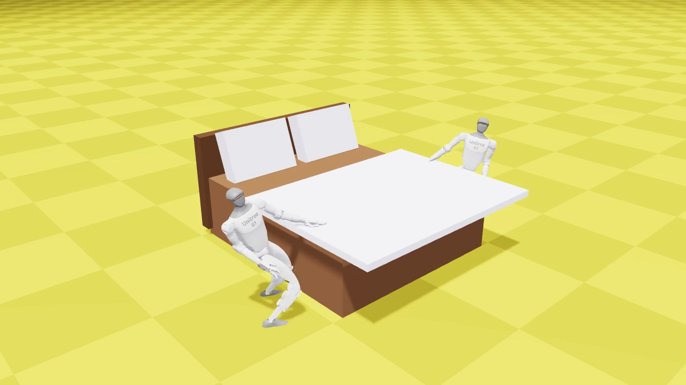

# Two Unitree G1s make a bed on the Isaac Lab 3.0 **Newton** backend — coordinated over MHS

Two **Unitree G1 humanoids** flank one **correctly proportioned bed** (wide, low double bed +
headboard + two propped pillows), reach onto it, and **draw the cover headward toward the pillows**,
**each balancing on its own two feet** — every joint driven by the trained whole-body **bed-reach RL
policy** — while coordinating as **equal peers over the Model Hardware Standard (MHS)**. It runs
entirely on the **Isaac Lab 3.0 Newton (MuJoCo-Warp) backend** with **no Omniverse Kit / Isaac Sim**:
physics is Newton, the render is Newton's own GL viewer. This is the Newton twin of the Isaac Sim
demo in [`../isaac_bed_making`](../isaac_bed_making) — the same bed, ported off PhysX/Isaac Sim
([`robots#9`](https://github.com/armwaheed/robots/issues/9)).



A full headless run renders **[`media/newton_bed_making.mp4`](media/newton_bed_making.mp4)** and writes
the MHS message-flow trace to **[`media/mhs_trace.json`](media/mhs_trace.json)**.

## How it works

1. **One shared scene, two robots.** The RL *play* harness replicates one-robot environments, so it
   can only ever show "two robots near two grey boxes." Instead [`demo.py`](demo.py) builds a bespoke
   scene — two `G1_MINIMAL_CFG` articulations (`/World/Robot0`, `/World/Robot1`) flanking one bed +
   headboard + two pillows + a sheet — and steps a `SimulationContext` directly with the Newton
   MJWarp physics preset.
2. **Driven by the trained policy.** Each robot is driven by the exported bed-reach policy
   ([`bed_reach.py`](bed_reach.py)). The 127-D observation is reproduced by hand off each robot's
   `Articulation` buffers, and the 37-D action becomes a joint-position target
   (`target = action*0.5 + default_joint_pos`) — the exact contract the policy trained on. The policy
   is left-handed, so the +y-side robot is driven through a **bilateral mirror** (its sensed state is
   reflected into the policy's frame and the action reflected back) so both robots draw headward.
3. **Balance on their own feet.** The reach command is held near the middle of the trained reach box,
   where the policy holds balance exactly as it does in its play env — so the **free base is the
   default**: no base pinning, no joint freezing. (`--base-hold` is a documented gantry fallback if a
   run drifts.)
4. **MHS coordination.** The two robots run as equal MHS peers ([`coordination.py`](coordination.py),
   [`swarm_driver.py`](swarm_driver.py)) — the engine-agnostic layer shared with the Isaac demo, no
   simulator imports. They claim corners, emit events, and trade `askForHelp` / `offerHelp`; every hop
   is recorded to the trace ([`mhs_trace.py`](mhs_trace.py)).
5. **Newton-native render.** Frames are captured headless from Newton's own `ViewerGL`
   (`isaaclab_newton.video_recording`) — no RTX, no Kit — and encoded to an MP4.

## Authoritative geometry

The bed is copied verbatim from the Isaac demo ([`geometry.py`](geometry.py), world metres, long axis
**x**, head at −x): mattress `(2.0, 1.8, 0.61)`, headboard `(0.12, 1.9, 0.95)`, two pillows
`(0.5, 0.72, 0.16)` propped ~70° against the headboard, robots flanking the ±y long sides. It is a
wide, low double bed — not a stubby bench.

## The sheet is a **proxy** (stated up front)

The issue asks for a **real soft sheet** via Isaac Lab 3.0's coupled MJWarp+VBD solver. That solver's
deformable spawner (`spawn_mesh_rectangle` → `omni.physx.scripts.deformableUtils`) **hard-requires
Omniverse Kit / Isaac Sim**, which is not installed on this host and cannot be added without a risky,
possibly-incompatible aarch64 install that would also reintroduce the very Isaac Sim dependency this
Newton port exists to remove. Per the issue's stated fallback, the sheet here is therefore a **visible
proxy**: a thin, kinematic cover the robots draw headward. Everything else — the bed, headboard,
pillows, both policy-driven robots, and the MHS coordination — is real. Adding real coupled cloth is a
one-line physics swap once Kit is available (`sim.physics = CoupledMJWarpVBDSolverCfg(...)`, cloth as a
`DeformableObjectCfg`).

## Run it

On the DGX Spark, from the Isaac Lab 3.0 tree (`env_isaaclab` active), with this package on the path:

```bash
PYTHONPATH=/path/to/robots_demo MUJOCO_GL=egl \
  ./isaaclab.sh -p demo.py --headless --device cuda:0 \
    --policy /path/to/optionA_work/checkpoints/exported/policy.pt \
    --mhs loopback --seconds 8 --out newton_bed_making.mp4
```

| Flag | Effect |
| --- | --- |
| `--policy PATH` | Exported bed-reach `policy.pt`. Omit to hold the default pose (scene smoke). |
| `--mhs {loopback,none}` | `loopback` (default) coordinates over an in-process MHS bus; `none` skips it. |
| `--base-hold` | Pin each pelvis (gantry) and freeze the legs — a fallback if the free-base reach drifts. |
| `--no-mirror` | Drive the +y robot with the raw left-hand policy instead of the bilateral mirror. |
| `--seconds` / `--fps` | Demo length and output frame rate. |

## Files

| Path | Role |
| --- | --- |
| [`demo.py`](demo.py) | Entry point: scene, policy loop, cover draw, MHS beats, Newton-GL capture. |
| [`bed_reach.py`](bed_reach.py) | Deploy driver for the trained policy (127-D obs reproduction + bilateral mirror). |
| [`geometry.py`](geometry.py) | Authoritative bed/robot geometry + quaternion helpers (simulator-free). |
| [`coordination.py`](coordination.py) | In-process MHS swarm (loopback / real broker), wrapping the shared driver. |
| [`swarm_driver.py`](swarm_driver.py) · [`mhs_trace.py`](mhs_trace.py) · [`mhs_sidecar.py`](mhs_sidecar.py) | Engine-agnostic MHS peer, message-flow trace, SDK shim (shared with the Isaac demo). |
| [`newton_g1_locomotion.py`](newton_g1_locomotion.py) | Standalone proof that NVIDIA's shipped MuJoCo-Warp walking policy drives our G1 under Newton with zero retraining. |

## Honest limitations

- **Sheet is a rigid proxy**, not coupled VBD cloth (needs Kit — see above).
- **The reach is a stationary loco-manipulation reach**, not a walk-in: the bed-reach policy has no
  locomotion command, so the robots are placed at their bedside marks.
- **The draw is a grip-lock abstraction**: the cover is moved headward kinematically in step with the
  reach rather than held by a frictional grasp (the policy does not control the fingers on cloth).
- Rendering is the Newton GL viewer's flat-shaded look (no RTX materials without Kit); prop colours are
  set directly on the Newton model.
